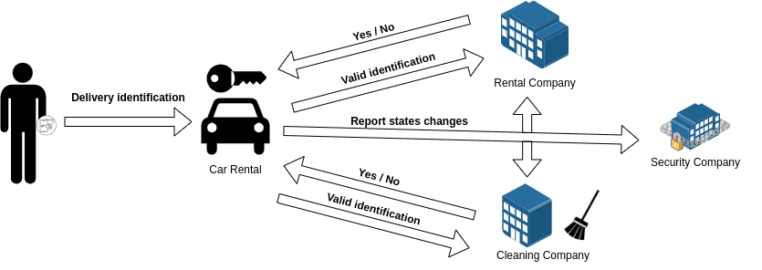

# Use case description

Somos una empresa de alquiler de vehículos que deseamos tener una trazabilidad del control de acceso. Un vehículo, sólo podrá ser abierto por un cliente registrado en el sistema y asignado al vehículo que desea abrir o personal autorizado como puede ser el servicio de limpieza/mantenimeinto. Cabe destacar, que la flota de vehículos dispone de un seguro, el cual nos obliga a informar sobre el control de acceso a los vehículos, permitiéndonos de esta manera tener un control de seguridad más riguroso y eficiente.

Para llevar a cabo el control de acceso, las cerraduras de los vehículos han sido equipadas con sistemas de apertura con NFC, conectadas al ordenador a bordo del coche, permitiéndonos así, implementar mecanismos de apertura a partir de dispositivos NFC como pueden ser los teléfonos móviles. Estas, recogerán la identidad del individuo en cuestión y la comunicarán tanto a la compañía de alquiler como a la compañía de limpieza/mantenimiento. Además, los vehículos contienen un sistema de cierre automático, por lo que cada vez que se cierran los mismos, quedan bloqueados y sólo es posible abrirlos mediante un dispositivo NFC autorizado. 

El objetivo final, es que sólo puedan abrir los vehículos los clientes registrados en el sistema de la compañía de renting o el personal autorizado. Esto, lo trataremos en base al estado del vehículo, los cuales son los siguientes:
- Libre: Este estado representa que le vehículo no se encuentra a disposición de ningún cliente y por tanto puede ser alquilado.
- Alquilado: Este estado representa que el vehículo se encuentra a disposición de un cliente y por tanto no puede se adjudicado a otro hasta el momento que se encuentre libre.
De esta manera, dependiendo del estado en el que se encuentre el vehículo, podremos gestionarlo de diferente manera.

## Participants

- Empresa de renting: Empresa propietaria de la flota de vehículos de los que se realizará el control de acceso.
- Cliente: Se trata de un cliente registrado en el sistema de la compañía de renta y en consecuencia con capacidad para abrir el vehículo adjudicado.
- Empresa de limpieza: Empresa externa que se encargará de la limpieza y mantenimiento de los vehículos de la empresa de renting cuando no estén alquilados.
- Trabajadores de limpieza: Trabajadores registrados en el sistema de la compañía de limpieza que se encargarán de la limpieza y mantenimiento de los vehículos.
- Empresa de seguros: Empresa externa que lleva un control de los vehículos de la empresa de renting para monitorear comportamientos anómalos y de esta manera tener una mayor seguridad sobre los vehículos.
- Cerradura inteligente: Dispositivo inteligente que puede ubicarse en los diferentes vehículos y que gestiona el acceso a los mismos a los individuos autorizados.