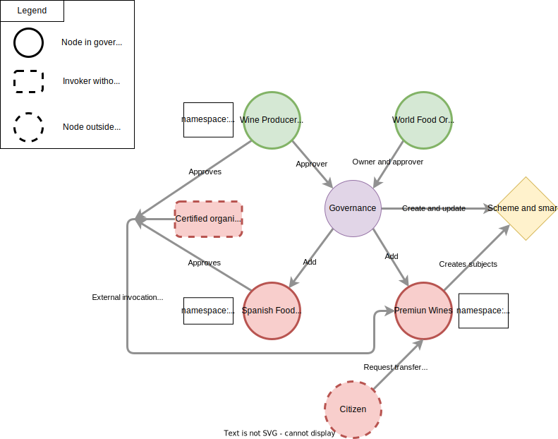

# Wine track

## Introduction

What we will learn in this tutorial will be divided into the following points:

1. [Execution of a node](running-node.md).
2. [Creation of governance](creating-governance.md).
3. [Creation of events](creating-event.md).
4. [Addition of a schema and a smart contract to the governance](adding-schema.md).
5. [Addition of new participants](adding-participants.md).
6. [Creation of subjects](creating-subject.md).
7. [External invocations](external-invocations.md).
8. [Approvals](approvals.md).
9. [Subject transfers](transfers.md).
10. [Namespace segmentation](segmentation.md).
11. [Changing voting policies in a subject](changing-policies.md).
12. [End of life of a subject](eol.md).

## Use case description

En este tutorial, te guiaremos a través del desarrollo de un caso de uso real utilizando Taple. Este ejemplo es muy útil para evaluar la viabilidad de esta tecnología en un entorno práctico, como el seguimiento del ciclo de vida de un vino de alta calidad. Este permitirá certificar a los compradores finales la calidad del vino desde su producción hasta su adquisición. Algunos aspectos que se pueden verificar incluyen la certificación orgánica y la temperatura, ya que para su correcta conservación no debería exceder un rango determinado.

Comenzaremos estableciendo el primer nodo llamado *Wine Producers Organization* (**WPO**), que será responsable de gestionar el caso de uso. A continuación, crearemos una gobernanza para formalizar el entorno en el que se desarrollará el caso de uso. La gobernanza será generada con un material criptográfico específico.

Una vez establecida la gobernanza, procederemos a crear eventos en Taple para modificar el estado de los sujetos en la red. Utilizaremos eventos de tipo **hecho** para modificar la gobernanza y agregar miembros a ella. Además, declararemos un esquema y un contrato inteligente para los sujetos de tipo *Wine* y los agregaremos a la gobernanza.

A medida que avanzamos en el tutorial, añadiremos participantes a la gobernanza, como *Premium Wines* y *World Food Organization* (**WFO**), asignándoles roles específicos. También permitiremos la ejecución de eventos por parte de agentes externos a la gobernanza y estableceremos aprobadores adicionales, como *Spanish Food Organization* (**SFO**), para garantizar el control de calidad.

Además, exploraremos la transferencia de propiedad de un sujeto de vino a un nuevo propietario externo a la gobernanza, y utilizaremos la segmentación por namespace para limitar la influencia de ciertos nodos en determinados contextos. A través de cambios en las políticas de gobernanza, simplificaremos el proceso de aprobación de eventos para los sujetos de vino.

Por último, abordaremos el fin de vida de un sujeto mediante la emisión de un evento de *End of Life* (**EOL**) para detener su ciclo de vida y evitar eventos posteriores.

A lo largo de este tutorial, te proporcionaremos instrucciones detalladas y los comandos necesarios para llevar a cabo cada paso. ¡Comencemos con el desarrollo de este emocionante caso de uso del ciclo de vida del vino en Taple!

La red resultante deberá tener un aspecto similar a este:

