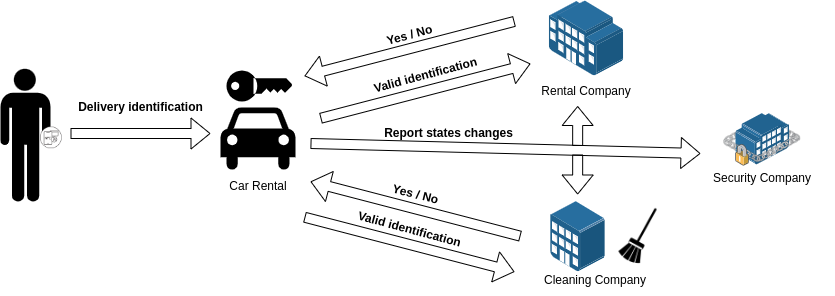

# Use case description

Somos una empresa de alquiler de vehículos que deseamos tener una trazabilidad del control de acceso sobre los mismos de forma que sólo pueda ser abierto por el personal autorizado. Un vehículo, sólo podrá ser abierto por un cliente registrado en el sistema y asignado al vehículo que desea abrir o personal autorizado como puede ser el servicio de limpieza/mantenimeinto. Para ello, se requiere que cualquiera de estos individuos disponga de una aplicación móvil con NFC para autenticarse contra las cerraduras de los vehículos. Estas, recogerán la identidad del individuo en cuestión y la comunicarán tanto a la compañía de alquiler como a la compañía de limpieza/mantenimiento. Además, los vehículos contienen un sistema de cierre automático, por lo que cada vez que se cierran los mismos, quedan bloqueados y sólo es posible abrirlos mediante un dispositivo NFC autorizado. Cabe destacar que para este caso de uso, tenemos los siguientes estados:
- Libre: Este estado representa que le vehículo no se encuentra a disposición de ningún cliente y por tanto puede ser alquilado.
- Alquilado: Este estado representa que el vehículo se encuentra a disposición de un cliente y por tanto no puede se adjudicado a otro hasta el momento que se encuentre libre.

## Participants

- Empresa de renting: Empresa propietaria de la flota de vehículos de los que se realizará el control de acceso.
- Cliente: Se trata de un cliente registrado en el sistema de la compañía de renta y en consecuencia con capacidad para abrir el vehículo adjudicado.
- Empresa de limpieza: Empresa externa que se encargará de la limpieza y mantenimiento de los vehículos de la empresa de renting.
- Trabajadores de limpieza: Trabajadores registrados en el sistema de la compañía de limpieza que se encargarán de la limpieza y mantenimiento de los vehículos.
- Empresa de seguros: Empresa externa que lleva un control de los vehículos de la empresa de renting para monitorear comportamientos anómalos y de esta manera tener una mayor seguridad sobre los vehículos.
- Cerradura inteligente: Dispositivo inteligente que puede ubicarse en los diferentes vehículos y que gestiona el acceso a los mismos a los individuos autorizados.