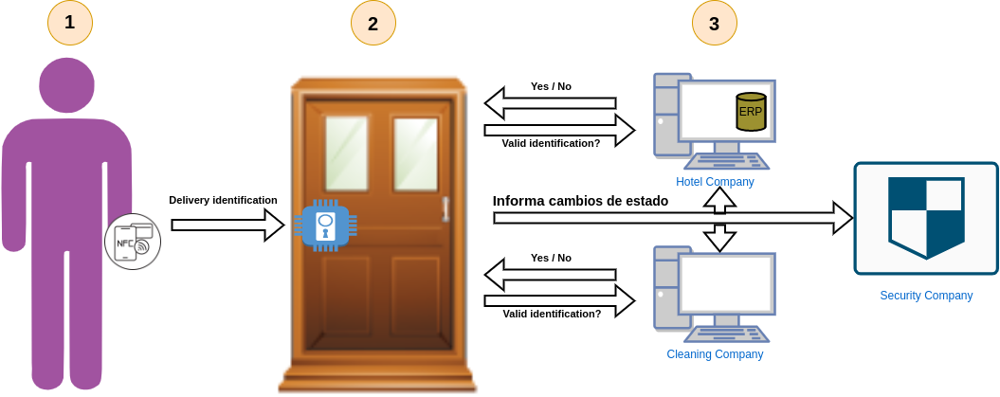

# Access Control

## Objective

The following tutorial is intended to instruct the user about external invocation through an access control use case in a hotel. External invocation is understood as the process through which a user proposes a change to a subject that he does not control.



## Participants

- **Customer**: This is a customer registered in the hotel system and, consequently, with the ability to open the door of his room. His role in the use case will be ***invoker***.
- **Cleaning workers**: Workers of a private cleaning company. They regularly come to the hotel to perform their duties. Their role in the use case will be ***invocator***.
- **Hotel company**: Owner company of the hotel in the use case. It will have the role of ***validator***.
- **Cleaning company**: Company to which the **cleaning workers** belong. It will have the role of ***validator***.
- **Security company**: Keeps track of the hotel guests and their entry and exit of their rooms for security purposes. Its role in the use case will be ***validator***, but ideally it would be a ***witness***.
- **Smart lock**: Smart device that can be located in the different doors of the hotel and that manages the access to the rooms to authorized personnel. Its role in the use case will be ***owner*** of the subjects that reflect the status of the doors.

## Description of the use case

The hotel company needs to regulate access to the different rooms of the hotel it manages, so that only authorized personnel can enter. An individual will be considered as such only if he/she is a customer registered in the system and assigned to the room he/she intends to enter or if he/she is a worker of the contracted cleaning company. To that end, it requires any such individual to have an NFC-enabled mobile app to authenticate against the smart locks. These will collect the identity of the individual in question and report it to both the hotel and the cleaning company. If either recognizes the data provided, then it will accept the access attempt. This confirmation will be sent to the lock, which will unlock the door.

Specifically, the door can have three states:
- Open.
- Locked.
- Closed.

To increase security, an automatic system has been added whereby if the door is in the **closed** state and has not changed state for 30 seconds, the smart lock closes the door and the its state changes to **locked**.

## TAPLE implementation

Each of the previously described actors would have a TAPLE node. Of these, the three companies and the smart locks would share governance as they are the known actors in the use case. The clients and the cleaners, on the other hand, are undetermined; we cannot know their identity until they register so they cannot be added to the governance. Each of the locks would manage a subject whose state would be a reflection of that of the door on which it is installed. Each time a user intends to enter a room, he/she makes an **external invocation** request to the subject in question. This request cannot be resolved by the lock itself, and this responsibility falls to the hotel company and the cleaning company. Both will receive a request for a vote on the above invocation. Each must check their internal applications and systems to verify that the identity of the invoker is valid. If it is a customer, the hotel will vote yes and the lock will be unlocked, idem for the cleaners and the cleaning company. Conversely, if it is an invalid summoner, both will reject the request, denying access to the room. 

When a lock automatically changes to **locked**, it is an invocation process again, but it differs from the previous one in the fact that it is not produced by an external actor, but by the **owner of the subject** to be modified. In this specific case, specific permissions are established in the governance to allow state updates to occur without requiring approvals.

We will now go into detail on how to model the system.

### Governance definition

In the governance we will define both the schema of the subjects and, more importantly for this example, the ***invocation permissions***.

In the first instance, the governance members must be defined. As mentioned earlier, these are the three companies and the existing smart locks. To facilitate the example, we will assume that there is only one of these locks in the hotel.

#### Governance members

In members, the use case actors are defined as previously indicated.

```json
    "members": [
        {
            "id": "Hotel",
            "tags": {},
            "description": "Hotel company that owns the hotel",
            "key": <controllerID of the TAPLE node installed on the machine representing the hotel company>
        },
        {
            "id": "Cleaning company",
            "tags": {},
            "description": "External cleaning company responsible for the cleaning of the hotel",
            "key": <controllerID of the TAPLE node installed on machine representing the cleaning company>
        },
        {
            "id": "Security company",
            "tags" : {},
            "description": "External security company responsible for hotel security",
            "key" : <controllerID of the TAPLE node installed on machine representing the security company>
        },
        {
            "id": "Intelligent lock",
            "tags": {},
            "description": "Lock installed on the door of the Presidential Suite",
            "key": <controllerID of the TAPLE node installed next to the microcontroller of the electronic lock that identifies it>
        },
    ]
```

#### Lock subjects schema

After defining the members, we specify the valid schemas for the subjects of our use case. In this case only one schema is considered: the one that allows us to define the state of the doors.

This, in JSON Schema format, would be defined as follows:

```json
    "schemas": [
        {
            "id": "lock_schema",
            "tags": {},
            "content":
            {
                "type":"object",
                "additionalProperties":false,
                "required": [
                    "current_state"
                ],
                "properties": {
                    "current_state": {
                        "type": "string",
                        "enum": ["LOCKED", "CLOSED", "OPENED"]
                    }
                }
            }
        }
    ]
```

#### Lock subjects policies
Finally, it is necessary to define the validation, approval and invocation permissions of the two types of subjects existing in the use case: the governance itself and the locks. We will start with the latter as it is considered to be of greater interest.
Note that these permissions establish, in particular, which users of the TAPLE network have the capacity and/or responsibility to perform the indicated actions.

:::info
For more information on how to define **policies** in governance, see the [Policies](./operational-guides/governance-configuration.md) page.
:::

The permits to be defined must guarantee that:
1. The validators of the lock must be only the cleaning company and the owner of the hotel. We will additionally add the security company due to simulate that it is a witness.
2. External invocations should be allowed, but should always be voted by the cleaning company and the hotel owner.
3. Changes proposed by the lock itself should be allowed and do not require a vote.

The corresponding permits would therefore be as follows:

```json
{
    "id": "lock_schema",
    "validation": {
        "quorum": 0.75,
        "validators": [
            <controllerID of the TAPLE node installed on the machine representing the hotel company>,
            <controllerID of the TAPLE node installed on machine representing the cleaning company>,
            <controllerID of the TAPLE node installed on machine representing the security company>
        ]
    },
    "approval": {
        "quorum": 0.5,
        "approvers": [
            <controllerID of the TAPLE node installed on the machine representing the hotel company>,
            <controllerID of the TAPLE node installed on machine representing the cleaning company>
        ]
    },
    "invokation": {
        "owner": {
            "allowance": true,
            "approvalRequired": false
        },
        "set": {
            "allowance": false,
            "approvalRequired": false,
            "invokers": []
        },
        "all": {
            "allowance": false,
            "approvalRequired": false,
        },
        "external": { // TAPLE Users not present in governance members specification
            "allowance": true,
            "approvalRequired": true
        }
    }
}
```

#### Governance subject policies

The governance permissions should ensure that:
1. all governance members must be validators, a fact that will enable them to maintain an up-to-date copy of the governance.
2. The hotel company, as the leader of the business, is the only one with the capacity to modify the governance. Any changes it proposes must be accepted without the need for a vote. Consequently, there is no need for approvers

```json
{
    "id": "governance",
    "validation": {
        "quorum": 0.5,
        "validators": [
            <controllerID of the TAPLE node installed on the machine representing the hotel company>,
            <controllerID of the TAPLE node installed on machine representing the cleaning company>,
            <controllerID of the TAPLE node installed on machine representing the security company>
            <controllerID of the TAPLE node installed next to the microcontroller of the electronic lock that identifies it>,
        ]
    },
        "approval": {
        "quorum": 0.5,
        "approvers": []
    },
    "invokation": {
        "owner": { // Only the hotel company will be able to modify the governance
            "allowance": true,
            "approvalRequired": false
        },
        "set": {
            "allowance": false,
            "approvalRequired": false,
            "invokers": []
        },
        "all": {
            "allowance": false,
            "approvalRequired": false
        },
        "external": {
            "allowance": false,
            "approvalRequired": false
        }
    }
}
```

#### Putting the pieces together

Putting all of the above together, we obtain the following:

<details>
  <summary>Governance JSON</summary>

```json
{
    "members": [
        {
            "id": "Hotel",
            "tags": {},
            "description": "Hotel company that owns the hotel",
            "key": <controllerID of the TAPLE node installed on the machine representing the hotel company>
        },
        {
            "id": "Cleaning company",
            "tags": {},
            "description": "External cleaning company responsible for the cleaning of the hotel",
            "key": <controllerID of the TAPLE node installed on machine representing the cleaning company>
        },
        {
            "id": "Security company",
            "tags" : {},
            "description": "External security company responsible for hotel security",
            "key" : <controllerID of the TAPLE node installed on machine representing the security company>
        },
        {
            "id": "Intelligent lock",
            "tags": {},
            "description": "Lock installed on the door of the Presidential Suite'",
            "key": <controllerID of the TAPLE node installed next to the microcontroller of the electronic lock that identifies it>
        },
    ],
    "schemas": [
        {
            "id": "lock_schema",
            "tags": {},
            "content":
            {
                "type":"object",
                "additionalProperties":false,
                "required": [
                    "current_state"
                ],
                "properties": {
                    "current_state": {
                        "type": "string",
                        "enum": ["LOCKED", "CLOSED", "OPENED"]
                    }
                }
            }
        }
    ],
    "policies": [
        {
            "id": "governance",
            "validation": {
                "quorum": 0.5,
                "validators": [
                    <controllerID of the TAPLE node installed on the machine representing the hotel company>,
                    <controllerID of the TAPLE node installed on machine representing the cleaning company>,
                    <controllerID of the TAPLE node installed on machine representing the security company>
                    <controllerID of the TAPLE node installed next to the microcontroller of the electronic lock that identifies it>,
                ]
            },
            "approval": {
                "quorum": 0.5,
                "approvers": []
            },
            "invokation": {
                "owner": { // Only the hotel company will be able to modify the governance
                    "allowance": true,
                    "approvalRequired": false
                },
                "set": {
                    "allowance": false,
                    "approvalRequired": false,
                    "invokers": []
                },
                "all": {
                    "allowance": false,
                    "approvalRequired": false
                },
                "external": {
                    "allowance": false,
                    "approvalRequired": false
                }
            }
        },
        {
            "id": "lock_schema",
            "validation": {
                "quorum": 0.75,
                "validators": [
                    <controllerID of the TAPLE node installed on the machine representing the hotel company>,
                    <controllerID of the TAPLE node installed on machine representing the cleaning company>,
                    <controllerID of the TAPLE node installed on machine representing the security company>
                ]
            },
            "approval": {
                "quorum": 0.5,
                "approvers": [
                    <controllerID of the TAPLE node installed on the machine representing the hotel company>,
                    <controllerID of the TAPLE node installed on machine representing the cleaning company>
                ]
            },
            "invokation": {
                "owner": {
                    "allowance": true,
                    "approvalRequired": false
                },
                "set": {
                    "allowance": false,
                    "approvalRequired": false,
                    "invokers": []
                },
                "all": {
                    "allowance": false,
                    "approvalRequired": false
                },
                "external": { // TAPLE Users not present in governance members specification
                    "allowance": true,
                    "approvalRequired": true
                }
            }
        }
    ]
}
```

</details>

## Starting up the system

Once the problem has been modeled and adapted to run against TAPLE nodes, it is time to lift the system.

### Lifting the TAPLE nodes

We will proceed to raise the four TAPLE nodes required for the system. For this purpose, the [**keygen**](./taple-tools.md) tool has been used to generate the cryptographic materials for the following nodes:

- Hotel company
    <details>
      <summary>Hotel company node</summary>

  ```bash
  docker run -d --rm --network=host -e TAPLE_HTTPPORT=9000 \
      -e TAPLE_NETWORK_ADDR=/ip4/0.0.0.0/tcp \
      -e TAPLE_NETWORK_P2PPORT=40000 \
      -e TAPLE_NODE_SECRETKEY=eabb6556b95dd3e8c623e2609f05199d3297988e9f2f15034554351f8cccd0bd \
      -e RUST_LOG=info \
      --name="hotel_node" \
      opencanarias/taple-client:latest
  ```

    </details>

- Cleaning company
    <details>
      <summary>Cleaning company node</summary>

  ```bash
  docker run -d --rm --network=host -e TAPLE_HTTPPORT=9001 \
      -e TAPLE_NETWORK_ADDR=/ip4/0.0.0.0/tcp \
      -e TAPLE_NETWORK_P2PPORT=40001 \
      -e TAPLE_NODE_SECRETKEY=7a25f489e71f24d5029cfe279bef46f66b5a25fed597bc4579f1cf722f76665d \
      -e RUST_LOG=info \
      -e TAPLE_NETWORK_KNOWNNODES=/ip4/127.0.0.1/tcp/40000/p2p/12D3KooWEWhaP2pYWoQ9qmWvLNas5tia2ytKriNYMHV5k6DrVR77 \
      --name="cleaning_node" \
      opencanarias/taple-client:latest
  ```

    </details>

- Security company
    <details>
      <summary>Security company node</summary>

  ```bash
  docker run -d --rm --network=host -e TAPLE_HTTPPORT=9002 \
      -e TAPLE_NETWORK_ADDR=/ip4/0.0.0.0/tcp \
      -e TAPLE_NETWORK_P2PPORT=40002 \
      -e TAPLE_NODE_SECRETKEY=46e546a11b23bf039ec924d468b8f8aa612b923befdb44cb3874f3ed9a902706 \
      -e RUST_LOG=info \
      -e TAPLE_NETWORK_KNOWNNODES=/ip4/127.0.0.1/tcp/40000/p2p/12D3KooWEWhaP2pYWoQ9qmWvLNas5tia2ytKriNYMHV5k6DrVR77 \
      --name="security_node" \
      opencanarias/taple-client:latest
  ```

    </details>

- Smart lock
    <details>
      <summary>Levantando nodo TAPLE - Cerradura 1</summary>

  ```bash
  docker run -d --rm --network=host -e TAPLE_HTTPPORT=9003 \
      -e TAPLE_NETWORK_ADDR=/ip4/0.0.0.0/tcp \
      -e TAPLE_NETWORK_P2PPORT=40003 \
      -e TAPLE_NODE_SECRETKEY=c0f98c23594cd102acffeb1bdfbfff9316e3d755401a83c8ac54aacfa0773739 \
      -e RUST_LOG=info \
      -e TAPLE_NETWORK_KNOWNNODES=/ip4/127.0.0.1/tcp/40000/p2p/12D3KooWEWhaP2pYWoQ9qmWvLNas5tia2ytKriNYMHV5k6DrVR77 \
      --name="lock_node" \
      opencanarias/taple-client:latest
  ```

    </details>

### Creating governance

The governance was defined previously, and now we proceed to create it in the network. The operation will be performed against the hotel node.

<details>
    <summary>Creating governance (in the Hotel node) - Command</summary>

```bash
    curl --silent --location --request POST 'http://localhost:9000/api/requests' \
--header 'Content-Type: application/json' \
--data-raw '{
    "request": {
        "Create": {
            "governance_id": "",
            "namespace": "",
            "schema_id": "governance",
            "payload": {
                "Json": {
                    "members": [
                        {
                            "id": "Hotel",
                            "tags": {},
                            "description": "Hotel company that owns the hotel",
                            "key": "ERcPsmdZcWoJ4J40lly2Qmqw68nZUsivbm1pU5R58q3I"
                        },
                        {
                            "id": "Cleaning company",
                            "tags": {},
                            "description": "External cleaning company responsible for the cleaning of the hotel"",
                            "key": "EVyCGyjbKvRAvh_7o0VIgiw7vEVgT8JH9maC7j0YBHBE"
                        },
                        {
                            "id": "Security company",
                            "tags": {},
                            "description": "External security company responsible for hotel security",
                            "key": "EULl2pIaSrnMXf6QLqT5VDFz_nrBKQEyCcEW3gyVU7oE"
                        },
                        {
                            "id": "Intelligent lock",
                            "tags": {},
                            "description": "Lock installed on the door of the Presidential Suite",
                            "key": "EghUiMxbkME_zHZMwSf9CD1eVZZuG2yDnMGBxmeoypk0"
                        }
                    ],
                    "schemas": [
                        {
                            "id": "lock_schema",
                            "tags": {},
                            "content": {
                                "type": "object",
                                "additionalProperties": false,
                                "required": [
                                    "current_state"
                                ],
                                "properties": {
                                    "current_state": {
                                        "type": "string",
                                        "enum": [
                                            "LOCKED",
                                            "CLOSED",
                                            "OPENED"
                                        ]
                                    }
                                }
                            }
                        }
                    ],
                    "policies": [
                        {
                            "id": "governance",
                            "validation": {
                                "quorum": 0.5,
                                "validators": [
                                    "ERcPsmdZcWoJ4J40lly2Qmqw68nZUsivbm1pU5R58q3I",
                                    "EghUiMxbkME_zHZMwSf9CD1eVZZuG2yDnMGBxmeoypk0",
                                    "EVyCGyjbKvRAvh_7o0VIgiw7vEVgT8JH9maC7j0YBHBE",
                                    "EULl2pIaSrnMXf6QLqT5VDFz_nrBKQEyCcEW3gyVU7oE"
                                ]
                            },
                            "approval": {
                                "quorum": 0.5,
                                "approvers": [
                                ]
                            },
                            "invokation": {
                                "owner": {
                                    "allowance": true,
                                    "approvalRequired": false
                                },
                                "set": {
                                    "allowance": false,
                                    "approvalRequired": false,
                                    "invokers": []
                                },
                                "all": {
                                    "allowance": false,
                                    "approvalRequired": false
                                },
                                "external": {
                                    "allowance": false,
                                    "approvalRequired": false
                                }
                            }
                        },
                        {
                            "id": "lock_schema",
                            "validation": {
                                "quorum": 0.75,
                                "validators": [
                    "ERcPsmdZcWoJ4J40lly2Qmqw68nZUsivbm1pU5R58q3I",
                    "EVyCGyjbKvRAvh_7o0VIgiw7vEVgT8JH9maC7j0YBHBE",
                    "EULl2pIaSrnMXf6QLqT5VDFz_nrBKQEyCcEW3gyVU7oE"
                                ]
                            },
                            "approval": {
                                "quorum": 0.5,
                                "approvers": [
                    "ERcPsmdZcWoJ4J40lly2Qmqw68nZUsivbm1pU5R58q3I",
                    "EVyCGyjbKvRAvh_7o0VIgiw7vEVgT8JH9maC7j0YBHBE"
                                ]
                            },
                            "invokation": {
                                "owner": {
                                    "allowance": true,
                                    "approvalRequired": false
                                },
                                "set": {
                                    "allowance": false,
                                    "approvalRequired": false,
                                    "invokers": []
                                },
                                "all": {
                                    "allowance": false,
                                    "approvalRequired": false
                                },
                                "external": {
                                    "allowance": true,
                                    "approvalRequired": true
                                }
                            }
                        }
                    ]
                }
            }
        }
    }
}'
```

</details>

### Creating the subject

After that, the first state of our lock is created through the construction of its subject. This operation is performed against the node of the lock.

<details>
    <summary>Creating the subject - Command</summary>

```bash
    curl --silent --location --request POST 'http://localhost:9003/api/requests' \
--header 'Content-Type: application/json' \
--data-raw '{
    "request": {
        "Create": {
            "governance_id": "Ju9MIHUs6eyS_yPRAkrIpYQhg2wkMJAB4vETqvRpC1po",
            "namespace": "",
            "schema_id": "lock_schema",
            "payload": {
                "Json": {
                    "current_state": "LOCKED"
                }
            }
        }
    }
}'
```

</details>

### Lock Unlock Request (Sending external request)

Next we will simulate the interaction of a hotel customer with the lock defined above. For this case, and taking into account that it is an example and not a real situation, it is not necessary to raise a new node, since the external request will be generated with the tool scripts [**keygen**](./taple-tools.md) and [**sign**](./taple-tools.md#taple-sign) and the request will be passed to the lock so that it generates the event in the subject.

First we use [**keygen**](./taple-tools.md):

```bash
taple-keygen
```

Whose result (with different cryptographic material) will be:

```bash
keygen
["taple-keygen"]
PRIVATE KEY ED25519 (HEX): bdc3ea6396f0a60dfb4d92f1811e2fead7e436ebd5449a913c3af2f761983caf
CONTROLLER ID ED25519: Evb_T0ASdQDy2z5Vo8pzH-lhLcvAnrqp2T_cWMRF3b2s
PeerID: 12D3KooWNb4soq1eUhb7waXvLPPELoQ5tJHAyFtis6ucJMXGykVQ
```

We will use the private key to sign the lock opening request with the [**sign**](./taple-tools.md#taple-sign) script (change {{subject_id}} to the id of the subject representing the lock):

```bash
sign bdc3ea6396f0a60dfb4d92f1811e2fead7e436ebd5449a913c3af2f761983caf "{\"subject_id\":\"{{subject_id}}\",\"payload\":{\"Json\":{\"current_state\":\"CLOSED\"}}}"
```

Resultado:

```json
{
  "request": {
    "State": {
      "subject_id": "JpFiMC3Ocy_4qm3qFIPPv4kKfhYm5p8BvCrcjkg0Id6A",
      "payload": {
        "Json": {
          "current_state": "CLOSED"
        }
      }
    }
  },
  "timestamp": 1673966552344,
  "signature": {
    "content": {
      "signer": "Evb_T0ASdQDy2z5Vo8pzH-lhLcvAnrqp2T_cWMRF3b2s",
      "event_content_hash": "J_Ah3VcZzT2piup1sAR_le8WWEk6Cf666VNit4nCcfPA",
      "timestamp": 1673966552344
    },
    "signature": "SELMLXCnBukB3HxBBaPftwjKOMajD2FBKUlzI5hUbGxqvQgVT3500LgohNKAMKHDBiYUKkKbOTyIvh0Tesf-AJBw"
  }
}
```

Next, the external invocation must be made to the lock node simulating the interaction between the door and the client's mobile application:

```bash
curl --silent --location --request POST 'http://localhost:9003/api/requests' \
--header 'Content-Type: application/json' \
--data-raw '{
    "request": {
        "State": {
            "subject_id": "JpFiMC3Ocy_4qm3qFIPPv4kKfhYm5p8BvCrcjkg0Id6A",
            "payload": {
                "Json": {
                    "current_state": "CLOSED"
                }
            }
        }
    },
    "timestamp": 1673966552344,
    "signature": {
        "content": {
            "signer": "Evb_T0ASdQDy2z5Vo8pzH-lhLcvAnrqp2T_cWMRF3b2s",
            "event_content_hash": "J_Ah3VcZzT2piup1sAR_le8WWEk6Cf666VNit4nCcfPA",
            "timestamp": 1673966552344
        },
        "signature": "SELMLXCnBukB3HxBBaPftwjKOMajD2FBKUlzI5hUbGxqvQgVT3500LgohNKAMKHDBiYUKkKbOTyIvh0Tesf-AJBw"
    }
}'
```

Once the request has been made, it must be accepted by one of the approvers: the hotel or the cleaning company. In this case, the hotel itself accepts the request for approval, since it consults the client's ID in the signature of the request and checks it against its database to confirm that he/she is the resident of that room.

Check pending approvals in the hotel company node:

```bash
curl --silent --location --request GET 'http://localhost:9000/api/approvals' \
```

With a result:

```json
[
  {
    "request": {
      "State": {
        "subject_id": "JpFiMC3Ocy_4qm3qFIPPv4kKfhYm5p8BvCrcjkg0Id6A",
        "payload": {
          "Json": "{\"current_state\":\"CLOSED\"}"
        }
      }
    },
    "timestamp": 1673966552344,
    "signature": {
      "content": {
        "signer": "Evb_T0ASdQDy2z5Vo8pzH-lhLcvAnrqp2T_cWMRF3b2s",
        "event_content_hash": "J_Ah3VcZzT2piup1sAR_le8WWEk6Cf666VNit4nCcfPA",
        "timestamp": 1673966552344
      },
      "signature": "SELMLXCnBukB3HxBBaPftwjKOMajD2FBKUlzI5hUbGxqvQgVT3500LgohNKAMKHDBiYUKkKbOTyIvh0Tesf-AJBw"
    },
    "approvals": []
  }
]
```

The id of the request is the one in the **event_content_hash** field of the signature, in this case **J_Ah3VcZzT2piup1sAR_le8WWEk6Cf666VNit4nCcfPA**. The hotel will then proceed to accept it, which will be enough to reach the quorum and the event will be effective:

```bash
curl --silent --location --request PUT 'http://localhost:9000/api/approvals/J_Ah3VcZzT2piup1sAR_le8WWEk6Cf666VNit4nCcfPA' \
--header 'Content-Type: application/json' \
--data-raw '{
    "approvalType": "Accept"
}'
```

Next, to confirm this, we will look at the status of the lock subject in the lock node:

```bash
curl --silent --location --request GET 'http://localhost:9003/api/subjects/JpFiMC3Ocy_4qm3qFIPPv4kKfhYm5p8BvCrcjkg0Id6A' \
```

Whose current result is:

```json
{
  "subject_id": "JpFiMC3Ocy_4qm3qFIPPv4kKfhYm5p8BvCrcjkg0Id6A",
  "governance_id": "Ju9MIHUs6eyS_yPRAkrIpYQhg2wkMJAB4vETqvRpC1po",
  "sn": 1,
  "public_key": "EJoXnHQeaf_xvIZvylv3TSaQoLMIY4HsWVnsnrzNZaVA",
  "namespace": "",
  "schema_id": "lock_schema",
  "owner": "EghUiMxbkME_zHZMwSf9CD1eVZZuG2yDnMGBxmeoypk0",
  "properties": "{\"current_state\":\"CLOSED\"}"
}
```

Suppose the customer opens the door, whereupon the lock generates a state change event from **CLOSED** to **OPEN**:

```bash
curl --silent --location --request POST 'http://localhost:9003/api/requests' \
--header 'Content-Type: application/json' \
--data-raw '{
    "request": {
        "State": {
            "subject_id": "JpFiMC3Ocy_4qm3qFIPPv4kKfhYm5p8BvCrcjkg0Id6A",
            "payload": {
                "Json": {
                    "current_state": "OPENED"
                }
            }
        }
    }
}'
```

As we can see in the result of the request in this case the status is updated immediately as it does not require approval. Once the user closes the door it goes back to LOCKED status.

```bash
curl --silent --location --request POST 'http://localhost:9003/api/requests' \
--header 'Content-Type: application/json' \
--data-raw '{
    "request": {
        "State": {
            "subject_id": "JpFiMC3Ocy_4qm3qFIPPv4kKfhYm5p8BvCrcjkg0Id6A",
            "payload": {
                "Json": {
                    "current_state": "LOCKED"
                }
            }
        }
    }
}'
```
