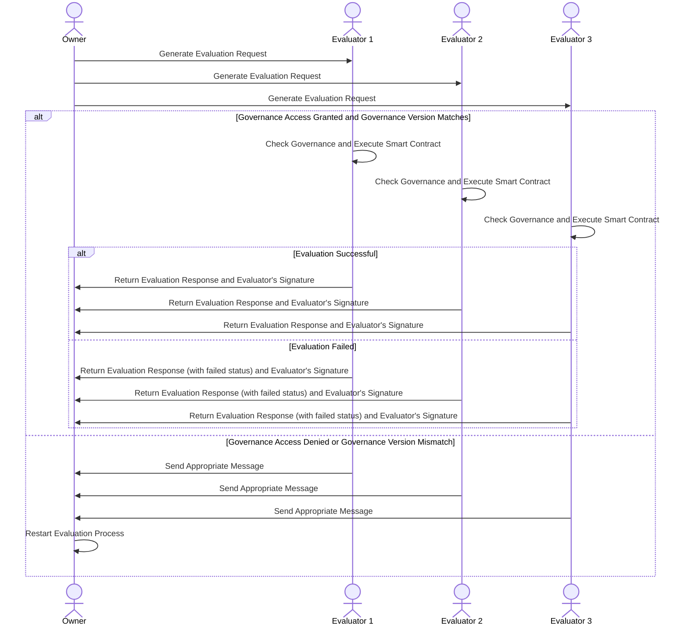

# Event evaluation process

The evaluation phase consists of the owner of th subject sending an evaluation request to the evaluators, just after the issuer generated an event request with the event type and its content. Currently, evaluation is only present in Fact type events, in the other types it's skipped. These events affect a certain subject to establish a fact that may or may not modify the subject's state. A context is also sent containing the necessary information for the evaluators to execute the smart contract that contains the evaluation logic for our subject, such as previous state, whether the issuer is the owner of the subject, etc. This is the case because the evaluators do not necessarily have a copy of the subject, so they need this data, which includes everything necessary for the execution of the smart contract.

The evaluators are defined by the governance, so they must possess it in order to carry out the evaluation, otherwise they would not have access to the contract, which in turn is stored in the state of the governance.

The result of applying the event to the subject in terms of property modification is carried out by the evaluators. They have the ability to compile and execute smart contracts compiled in web assembly.

The Fact event request contains the necessary information to execute one of the functions of the contract (or not, in which case a failed evaluation occurs and the subject owner is notified). The response includes whether the evaluation was successful or failed, if it is necessary to go through the approval phase and the JSON patch that, when applied to the subject's state, will produce the state change, as well as the hash of the updated state.

The evaluators response is signed by them so that the witnesses can verify that quorum has been reached in the evaluation phase and that the correct evaluators have signed.

The evaluators will only carry out the evaluation if the version of the governance that the subject's owner has coincides with that of the evaluator. If it is lower or higher, an appropriate message for each case is sent to the subject's owner.

For issuers, when the governance to which the subject is assigned is updated, the process must be restarted from the beginning of the evaluation, whether you were still in the evaluation phase or already in the approval phase. This is because events must be evaluated/approved with the latest version of governance available.

