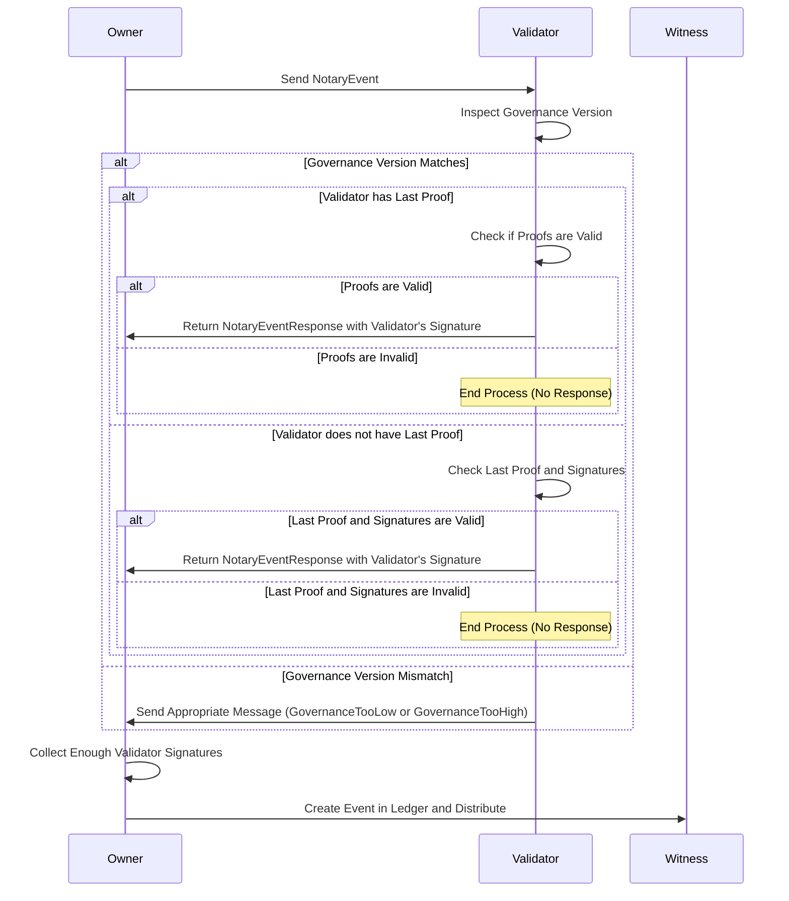

# Event validation process

The validation process is the last step before achieving a valid event that can be joined to the subject's chain. The aim of this phase is to ensure the uniqueness of the subject's chain. It is based on the collection of signatures from the validators, which are defined in the governance. It does not produce a change in the event itself, as the signatures are not included in the event, but they are necessary to validate it in the eyes of the witnesses. It is noteworthy that for the uniqueness of the chain to be fully effective, the validation quorum needs to consist of the majority of validators. This is because if not, several chains could be validated with different validators for each one if the sum of the signature percentage for all quorums does not exceed 100%.

## Proof of validation

What the validators sign is called proof of validation, the event itself is not directly signed. This is done to ensure the privacy of the event's data and at the same time add additional information that allows the validation process to be safer. In turn, when the owners of the subjects send the proof to the validators, it is also signed with the subject's cryptographic material. It has this form:

```Rust
pub struct ValidationProof {
    /// The identifier of the subject being validated.
    pub subject_id: DigestIdentifier,
    /// The identifier of the schema used to validate the subject.
    pub schema_id: String,
    /// The namespace of the subject being validated.
    pub namespace: String,
    /// The name of the subject being validated.
    pub name: String,
    /// The identifier of the public key of the subject being validated.
    pub subject_public_key: KeyIdentifier,
    /// The identifier of the governance contract associated with the subject being validated.
    pub governance_id: DigestIdentifier,
    /// The version of the governance contract that created the subject being validated.
    pub genesis_governance_version: u64,
    /// The sequence number of the subject being validated.
    pub sn: u64,
    /// The identifier of the previous event in the validation chain.
    pub prev_event_hash: DigestIdentifier,
    /// The identifier of the current event in the validation chain.
    pub event_hash: DigestIdentifier,
    /// The version of the governance contract used to validate the subject.
    pub governance_version: u64,
}
```

Data such as the **governance_version**, which is used to verify that the vote should only be returned if it matches the subject's governance version for the validator, and the **subject_public_key** is the one used to validate the owner's signature of the next proof of validation that reaches the validator.

If the validator has the previous proof, they can validate certain aspects, such as the **prev_event_hash** of the new one matches the **event_hash** of the previous one. The validators' database will always store the last proof they signed for each subject. This allows them never to sign two proofs for the same subject_id and sn but with different other data (except for the **governance_version**). This guarantees the uniqueness of the chain. The ability to change the **governance_version** is due to what we discussed earlier: if a validator receives a proof with a different governance version than theirs, they should not sign it. Therefore, facing updates of the governance in the middle of a validation process, the owner must restart said process, adapting the **governance_version** of the proof to the new one.

Another interesting point is the case where validators do not have the previous proof to validate the new one. There is no scenario where validators always have the previous proof, since even when the quorum requires 100% of the signatures, if a change in governance adds a new validator, they will not have the previous proof. This is why when a validation is requested, it should send:

```Rust
pub struct NotaryEvent {
    pub proof: ValidationProof,
    pub subject_signature: Signature,
    pub previous_proof: Option<ValidationProof>,
    pub prev_event_validation_signatures: HashSet<Signature>,
}
```

The previous proof is optional because it does not exist in the case of event 0. The hashset of signatures includes all the signatures of the validators that allow the previous proof to have reached quorum. With this data, the validator can trust the previous proof sent to them if they do not previously have it.

The communication to request validation and to send validation is direct between the controller and the validator and is carried out asynchronously.

## Correct Chain

As we mentioned earlier, the validation phase focuses on achieving a unique chain, but not on whether this chain is correct. This responsibility ultimately falls on the witnesses, who are the subject's stakeholders. The validators do not need to have the subject's updated chain to validate the next proof, as the proofs are self-contained and at most require information from the previous proof. But nothing prevents a malicious controller from sending erroneous data in the proof, the validators will not realize it because they do not have the necessary context and will sign as if everything was correct. The witnesses, however, do have the updated subject, so they can detect this kind of tricks. If something like this were to happen, the witnesses are the ones responsible for reporting it and the subject would be blocked.

## Sequence Diagram


