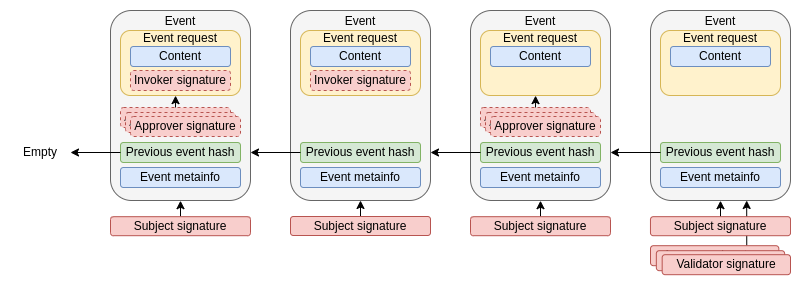

# Events
Events are the data structures that make up the microledger, i.e., the chain of events. Each event is composed of the following:
- The request that generated the event
- The cryptographic fingerprint of the previous event to form the chain
- A series of meta information related to the subject and the event
- A group of different signatures that are added as the event progresses in its life cycle

## Event Request
Events are initially generated from an event request. This request contains the following:
- The type of event to generate;
- The information to include in the microledger, for example, to modify the subject's state;
- The signature of the invoker, which can be the subject's owner or another participant with sufficient permissions.

After generating an event request, it is sent to the subject's owner for approval and, if correct, it is converted into an event and becomes part of the subject's microledger.

:::info
Visit the [Event Life Cycle](./event-life-cycle.md) page for more details on how an event request becomes part of the microledger.
:::

## Signatures
Each event includes a series of signatures that provide different guarantees.

### Issuer signature
As explained, each event is generated from an event request. This request is signed by the participant who generates it, the invoker, providing assurance of who originated it. Additionally, it's the way that the network participants, at different stages of the event life cycle, can verify if the invoker had permission to make the request.

### Approvers signature
Depending on the use case, governance may specify that certain event requests must be approved. This means that, for an request to be transformed into an event, it must provide a series of additional signatures that give agreement on the request's content.

:::info
In TAPLE, [governance is a real subject](./governance.md) and typically its modifications require an approval phase.
:::

### Subject signature 
When creating the subject, a pair of keys was created that only the owner possesses. Each event is signed with the subject's private key, providing assurance that the event was generated by the owner.

### Validators signature
Due to the single-owner model, the owner of a subject could attempt to manipulate the network by generating different versions of the same event and sending different versions to different participants based on their own interests. To prevent this, a series of validation signatures must be collected before an event is distributed. Governance defines who the potential validators are and how many signatures are required to be collected.

:::info
The validation signatures are not part of the chain, but give guarantees to the participants that the owner is not being malicious. It is only necessary to store the validation signatures of the last event received, and the previous ones can be deleted. 
::: 

## Event types
Within TAPLE, there are different types of events when operating with a subject.

### Genesis Event
Es el evento inicial a partir del cual se crean los sujetos. Cada sujeto tiene un único evento de génesis en el cual se definen su identificador, propietario y el esquema que modelará su estado. Este evento proporciona un estado inicial por defecto al sujeto, estableciendo su valor dentro del marco de gobernanza.

Otras características importantes de este evento son que el namespace se especifica en él y no puede cambiar a lo largo del ciclo de vida del sujeto. Además, el evento de génesis no requiere ser evaluado, ya que no implica la ejecución de un contrato, ni necesita ser aprobado, ya que cualquier entidad puede generar un sujeto con estas características. Sin embargo, si no cumple con alguna regla de distribución, el sujeto será rechazado.

### Fact Event
Estos son los eventos de ejecución de algunos de los métodos que posee el contrato inteligente. Estos eventos requieren evaluación (ejecución del contrato) y, opcionalmente, aprobación por parte de los nodos correspondientes.

### Transfer Event 
Events that allow the owner of a subject to be modified. A subject has a single owner at any given time. However, thanks to this event, that owner can be changed, transferring ownership to a new member.

### End of Life Event (EOL)
End-of-life events are used when the subject has reached the end of its useful life and should no longer receive any more events, whether for functional, legal, or any other reasons. Once a subject successfully includes an end-of-life event in its microledger, the TAPLE protocol will reject any attempts to generate a new event.