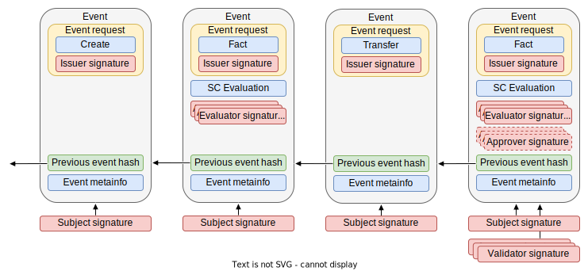

# Events
Events are the data structures that represent the facts to be traced during the life of a subject. These structures make up the micro-logger, i.e. the chain of events.

Each event is composed of the following:
- The request that generated the event
- The cryptographic fingerprint of the previous event to form the chain
- A series of meta information related to the subject and the event
- A group of different signatures that are added as the event progresses in its life cycle

## Event life cycle

The event life cycle is composed of 6 stages, from its generation request to its distribution.

### Event request 
To change the state of a subject it is necessary to add an event to its microleger. To do so, the first step is to generate an **event request**. In TAPLE [only the owner of the subject can generate events on the subject](./subjects.md#ownership-model). However, these events can be generated by requests from other participants, known as **issuers**. In this way, the owner acts as the organizer of the event requests, which can be generated by himself or by other participants.  

:::caution Important

Being the only one who can input events into the micro-logger, the owner has the final say on whether or not to create an event from a request, even if it is sent by another participant. In situations where assurance that the request has been recorded is necessary, additional security measures beyond those offered by TAPLE must be implemented.

:::

Event requests contain the following:
- The type of event to generate;
- The information to include in the microledger, for example, to modify the subject's state;
- The signature of the issuer, which can be the subject's owner or another participant with sufficient permissions.

:::info

Currently the TAPLE P2P protocol does not support sending event requests to the owner of a subject, having to use other mechanisms, such as the REST API. 

:::

### Event evaluation
In TAPLE there are different [event types](#event-types) and not all of them share the same life cycle. In the case of de [fact events](#fact-event) there are 2 additional steps: evaluation and approval. 

The evaluation phase corresponds to the execution of smart contracts. For this, the owner of the subject sends the following information to the evaluators:
- the current state of the subject, as the evaluators do not need to witness the subject, and therefore may not have its state;
- the metadata of the subject, such as its schema and namespace.

After receiving the information the evaluator executes the contract and returns the modified subject state to the subject owner, [the need or not for approval](#event-approval), and its signature. The owner must collect as many evaluator signatures as governance dictates.

:::info

Click [here](./event-evaluation-process.md) to learn more about the event evaluation process.

:::

### Event approval
The evaluation of some contracts may determine that the outcome, even if properly executed, requires approval. This means that, in order to be accepted by the other participants, need to include a number of additional signatures from other participants, the approvers. These approvers sign for or against an event request. The rules defined in the governance indicate which signatures are necessary for an event petition to be approved and, therefore, for an event to be generated from this request. 

The decision whether or not to approve a request may depend on the involvement of an individual or it may depend on some IT system, such as a business intelligence process.

:::tip

In TAPLE, [governance is a real subject](./governance.md) and typically its modifications require an approval phase.

:::

:::info

If you want to know more details about the event approval process visit [this page](./event-approval-process.md).

:::

### Event generation
The next step is the effective generation of the event. The event is composed including the request, the contract evaluation, the signatures of the evaluators and approvers, the hash of the previous event and a series of metadata associated with the event. The event is signed then with the subject's cryptographic material, providing assurance that only the owner of the subject was able to generate the event.

### Event validation
A generated event cannot be distributed directly. The reason is that the other participants in the network have no guarantee that the owner has not generated different versions of the event and distributed these versions according to his own interests. To avoid this, the validation phase arises. A number of network participants, the validators, provide their signature to the event, guaranteeing that a single event exists. Not all subjects require the signatures of the same validators. Governance defines which participants must provide their signatures and how many signatures are required. The number of signatures will depend on the use case and the network's trust in the members acting as validators.  

:::important

Unlike the others, only the validation signatures associated with the last event of the micro-logger are stored. Previous validation signatures are deleted. The purpose of these signatures is to provide single chain guarantees, and for this reason, the signatures on the last event are sufficient to obtain these guarantees. 

:::

### Event distribution
Once there are enough validation signatures, the event is complete and can be distributed to the rest of the network participants. They will only check that the signatures included with the event are correct and that they comply with the requirements established in the governance.

## Event types
Within TAPLE, there are different types of events when operating with a subject.

### Create Event
It is the initial event from which subjects are created. Each subject has a unique genesis event in which are defined:
- its associated governance
- its subject-id or unique identifier in the network;
- the public key of the cryptographic key pair associated with the subject;
- initial owner, i.e. its creator;
- the schema that models its state;
- its initial state;
- its namespace; 
- and its name, a business identifier of the created subject.

:::info Difference between subjectId and name

It is important to note that the subjectId is unique at the network level, while the name is simply an identifier at the use case level and cannot be guaranteed to be unique.

:::

It is important to note that once a subject is created, its governance, subject-id, schema, namespace, and name cannot change. On the contrary, its public key and owner can be modified by a transfer event. In addition, its state can be modified through fact events. 

### Fact Event
Estos son los eventos que representan posibles cambios al estado del sujeto. Para ello desencadenan el proceso de evaluación (la ejecución del contrato) y, opcionalmente, el de aprobación.

### Transfer Event 
These are the events that represent possible changes to the state of the subject. They trigger the evaluation process (the execution of the contract) and, optionally, the approval process.

### End of Life Event (EOL)
End-of-life events are used when the subject has reached the end of its useful life and should no longer receive any more events, whether for functional, legal, or any other reasons. Once a subject successfully includes an end-of-life event in its microledger, the TAPLE protocol will reject any attempts to generate a new event.

