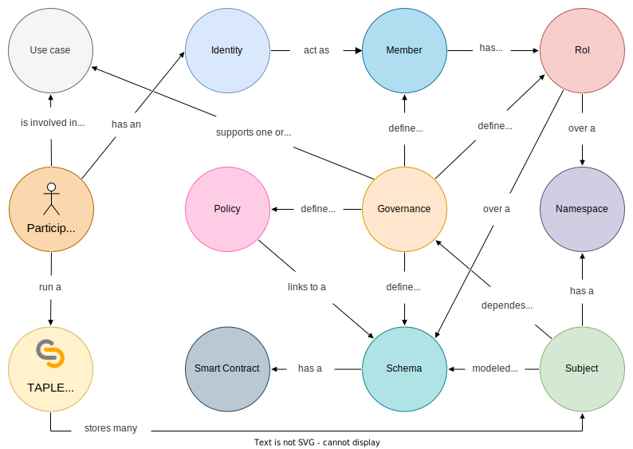

# Governance

A TAPLE network does not consist of a single ledger, but potentially multiple [microledgers](./subjects.md#microledger) stored within subjects. The management of these subjects requires the definition of mechanisms to facilitate this task in batch, not individually for each one, which can be created dynamically.

Governance is the set of rules that define how the various participants in a TAPLE network interact with each other and their relationship with the subjects.

Governance is responsible for defining: 
- the participants of one or more use cases; 
- the data structures that model subjects;
- the mechanisms for modifying the status of subjects;
- and the permissions that each participant has to operate in the network.

## Components
Governance is structured into the following components: members, schemas, policies and roles

### Members
These are the persons, entities or organizations that participate in the governance and therefore may be part of the use cases that are supported. Each member declares a unique identifier that represents the cryptographic material with which it will operate in the network, their [identity](./identity.md).

### Schemas
[Schemas](./schemas.md) are the data structures that model the information stored in the subjects. Within a governance, different schemas can be defined to support different use cases. When a subject is created, it defines which governance it is associated with and which schema it will use. Moreover, each scheme has a [smart contract](./smart-contracts.md) associated with it that will allow the status of the subjects to be modified. 

### Roles
[Roles](./roles.md) represent groups of participants with some kind of common interest in a set of subjects. Roles allow us to assign permissions over these groups of subjects more easily than if we had to assign them individually to each member of the governance. 

### Policies
Policies define the specific conditions under which the life cycle of an event is affected, such as the number of signatures needed to carry out the evaluation, approval and validation processes. This is called quorum.

The governance configuration allows the definition of [different types of quorum], more or less restrictive, depending on the need of the use case. 

:::caution

As we know, the owner of a subject [is the only one who can act on it](./subjects.md#ownership-model), and therefore has absolute freedom to modify it. Governance cannot prevent malicious owners from attempting to perform forbidden actions, but it does define the conditions under which the rest of the participants ignore, or penalize, these malicious behaviors. 

:::

## Relationship hierarchy

Governance defines the rules to be followed in a use case. However, a holder of a TAPLE node is not limited to participate in a single use case. Couple this with the governance structure and you get the following hierarchy of relationships:
- A governance:
  -  define one or many: members, policies, schemas and roles;
  -  supports one or many use cases.
- A participant (person, entity or organization):
  - has an [identity](./identity.md), and the identity act as a member of a governance.
  - run a [TAPLE node](./overview.md#taple-node) which stores many subjects;
  - is involved in one or many use cases.
- A subject:
  - depends on a governance;
  - is modeled by a schema;
  - has a namespaces

:::info

If you want to know how to define a governance to adapt it to your needs visit the [governance structure](../learn/governance-structure.md) page. 

:::

## Governance as a subject
Within the TAPLE network, the governance that governs it is managed as a subject, using the same protocol as the rest of the subjects for its [generation, approval, validation and distribution](./events.md#event-life-cycle). The subjects modeling governance meet the following conditions: 
- Are created using the governance scheme. This schema is defined internally in TAPLE protocol.
- When a generic subject is created, the associated governance is specified. Conversely, when creating a subject intended to model a governance, no value is specified.