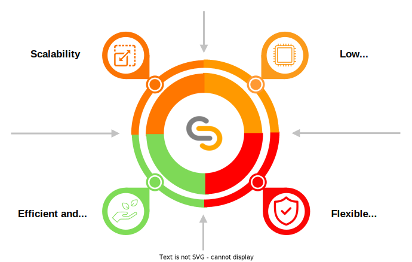
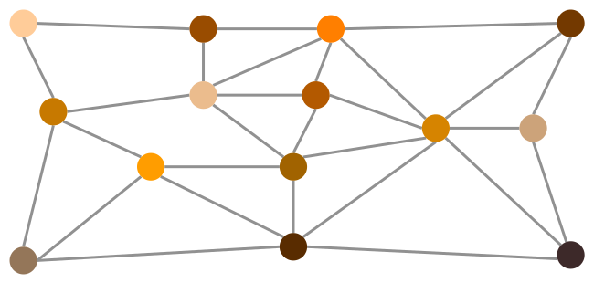
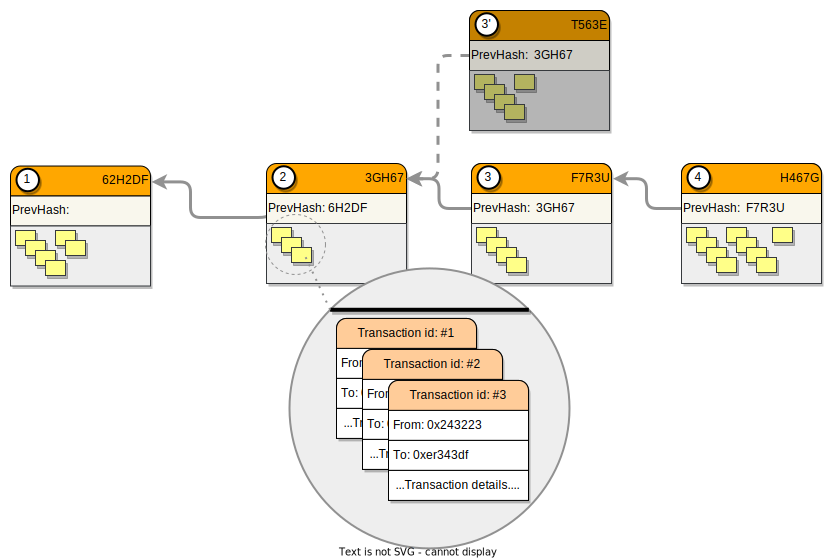
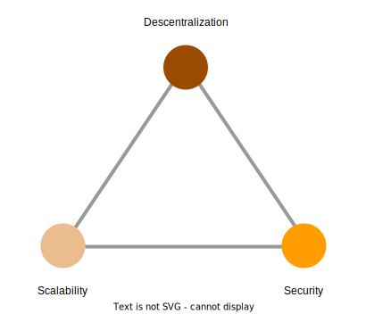
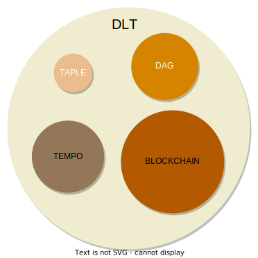
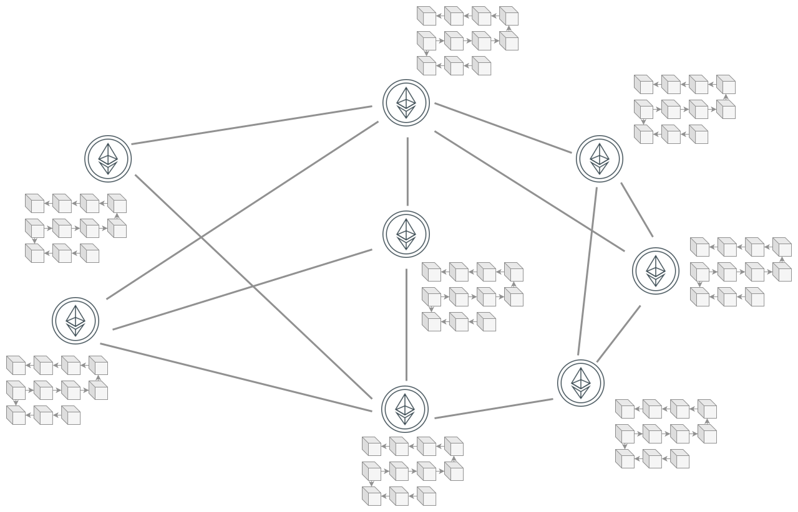

# TAPLE

TAPLE (pronounced T+🍎 ['tapəl]​) stands for *Tracking (Autonomous) of Provenance and Lifecycle Events​*. TAPLE is a permissioned [DLT](#dlt) solution for traceability of assets and processes.

## Objectives
Using Blockchain to try to provide solutions to traceability problems is complex. The number of participants, the heterogeneity of the use cases, the hardware limitations of the devices (IoT) or the difficulty of managing them are some of the challenges to be faced. 

TAPLE was created to address these problems and focuses on meeting the following objectives:

* Scaling to a sufficient level for traceability use cases. This implies both that the network supports such scalability, and that its configuration mechanisms allow it to be a simple process to perform and maintain.
* Support resource constrained devices.
* Have a flexible and adaptable cryptographic scheme mechanism for a multitude of scenarios, including PQC.
* Sustainable and efficient from the point of view of energy consumption.

## Background

### DLT

DLT stands for *Distributed Ledger Technology*, but, ¿what is really a DLT?. There are many definitions of DLT, but let's try to explain it in a simple way. Generally speaking, a [ledger](https://en.wikipedia.org/wiki/Ledger) is an accounting concept that basically defines a document in which information is always being added, usually in the form of transactions. These transactions are never deleted or modified, however, the result of these transactions can be modified by adding new transactions. A DLT is nothing more than a database that acts as such a ledger but also has, to a greater or lesser extent, the following characteristics:
- It is distributed and decentralised. The information is not located at a single point, but is distributed in a network of nodes in which there is usually no established hierarchy, all nodes being equal, or at least capable of offering the same capabilities to the network. Therefore, any node could talk to any other node.
- Shared. Usually not all nodes are under the control of the same organisation. This makes it necessary to assume that there could be malicious nodes within the network and, therefore, to establish security mechanisms. Moreover, not all nodes would have to have exactly the same information, as there could be private transactions, or simply different interest groups.
- Immutable and tamper-resistant. It implements cryptographic security mechanisms that prevent its content from being altered, or at least, if any node tries to modify the information, it can be easily detected and blocked.

:::info

What do some international organizations understand by DLT:
- [UK Goverment](https://www.gov.uk/government/news/distributed-ledger-technology-beyond-block-chain)
- [International Telecomunication Union](https://www.itu.int/en/ITU-T/focusgroups/dlt/Pages/default.aspx)
- [European Parliament](https://www.consilium.europa.eu/media/53681/st14993-en21.pdf)

:::

#### Types of DLT
DLT networks can be classified according to the type of access to the network itself and its information. 

Thus, according to the type of access we find: 
- Public networks. Those in which anyone can join and participate.
- Private networks. With the same elements as a public network, but one or several organisations are in charge of administering the network and controlling who is allowed to participate.

On the other hand, depending on the access to the information, we find:
- Permissionless networks. These are networks where anyone can request modifications or queries on the information stored in the block.
- Permissioned networks. These are networks where modifications and queries on the information stored in the block of the network members are limited and controlled by a series of permissions that the network administrators (people or organisations) must grant.

### Blockchain

Blockchain is a subtype of DLT, and therefore we can say that it is fundamentally a distributed, decentralized, shared, and immutable database. But blockchain is also characterized by the following:
- It has a data structure in the form of a chain. The information is stored by grouping blocks linked by their cryptographic fingerprints, thus giving rise to a chain system, where a given block stores the reference to its predecessor. This information is encrypted using advanced cryptographic methods, resulting in a block with unique and unambiguous information (the slightest change in any aspect of the block will result in a completely different chain, which will be invalidated by the system).
- The blocks include multiple transactions. As a measure to increase the capacity of networks, blocks typically group different transactions together. Moreover, these transactions do not necessarily belong to the same participant.  
- There is usually a single chain shared by all participants in the network. As it is shared by all participants, the degree of trust in the stored data is very high, giving rise to the concept of *single source of truth* . However, this is associated with very high and equal requirements for all nodes, even if they do not participate actively in the network or do so very little. Some blockchains are trying to solve this problem through partitioning techniques, such as the sharding proposed for Ethereum 2.
- Existence of consensus mechanisms. As there is a single shared chain (or a small group of them), it is necessary to establish mechanisms that prevent simultaneous block generation attempts by different participants from generating different chains. These mechanisms are consensus algorithms. The need for such control mechanisms is often one of the determining factors in the scalability of blockchain networks. 

:::info

Possibly the best known consensus mechanism is ***PoW (Proof of Work)***, used by both Bitcoin ([Bitcoin: A Peer-to-Peer Electronic Cash System](https://bitcoin.org/bitcoin.pdf)) and Ethereum until the release of Ethereum 2.0 ([Ethereum: Proof-of-work](https://ethereum.org/en/developers/docs/consensus-mechanisms/pow/)).

:::

#### When do we need a Blockchain?

To summarise, blockchain behaves like a large, distributed, secure and transparent database. These characteristics have meant that the main use cases in which it has been successful are related to the security of transfers of value and ownership. Blockchain allows stored information to be considered an asset and, as such, to have an owner. This feature is commonly known as tokenisation. This has been one of the pillars on which several use cases have been based, the best known being cryptocurrencies, DAOs and NFTs. 

However, Blockchain is a technology that is perfectly suited to other use cases. It is especially interesting in those use cases in which information needs to be shared securely between parties between whom there is not full trust. As it is a common database, in which information cannot be deleted, its level of transparency and trust is very high. Any transaction is always reflected by indicating what was changed, by whom and when. In addition, many blockchain technologies introduce the concept of smart contracts (SC). These SCs are pieces of code that allow certain tasks or calculations to be automated and can be used to implement business logic. In this way, all network participants not only see the same information but are able to react in the same way to any changes in the information. 

Thanks to these capabilities, blockchain has been successfully used in a multitude of areas, such as:
- Logistics
- Finance
- Public services
- Land registry
- Identity

#### When do we not?

Like any other technology, blockchain has a number of use cases for which it is, or is not, suitable. The [blockchain trilemma](https://vitalik.ca/general/2021/04/07/sharding.html), proposed by Vitalik Buterin, is represented as a triangle with the following concepts at each vertex:
- Decentralisation, or the network's ability to remain independent of organisations or hierarchical structures, avoiding their possible manipulation;
- Security, or the ability of the network to resist external attacks or data corruption;
- Scalability, or the ability to adapt to ever-increasing demands.

According to this trilemma, it is very difficult to satisfy all three concepts simultaneously, which marks the limits of the use of a blockchain technology. Many blockchain networks try to alleviate this problem, but to do so they need to sacrifice, at least in part, some of their advantages. For example, technologies such as Ethereum are committed to enhancing security and decentralisation, which has a direct impact on their ability to scale. 

:::info

For instance, Ethereum 2 intends to increase its scalability by introducing numerous changes to its architecture, for example:
- migrating the consensus protocol from PoW to PoS
- and Sharding, the partitioning of the chain into 64 shards

:::

Each use case is unique and it is necessary to assess your specific needs to determine whether it is appropriate to use a blockchain technology, which one, and if not, what alternatives are available, e.g. within other DLTs, for instance [TAPLE](index.md).

## TAPLE approach

TAPLE has been designed to meet the objectives presented above. This is achieved through certain properties that allow information to be divided into multiple chains, each associated with an asset in the network and managed only by a single node (understood as its owner). This role allows it to define how the chain evolves without requiring any consensus, although its capacity to intervene in the network is contained by a series of rules previously negotiated by the nodes participating in a use case.

Each of these characteristics will be discussed in more detail in the following sections.

### Partitioning of the ledger by assets
In conventional blockchain, such as Ethereum or Bitcoin, we are used to the existence of a single chain or Ledger where each of its elements corresponds to a block of transactions. These transactions are simply the different write operations, and consequently state modifying ones, that have occurred since the last recorded block, although there is also the possibility that empty blocks are generated, without any transaction. Regardless of the case, as these blocks are generated, they are transmitted to the other nodes of the network to ensure that all participants have the same chain and, consequently, share the same state.

Although this approach has proven to be functional, it has two main problems. First, the fact that each node in the network operates on the same chain implies that all nodes are forced to store transactions that are not of interest to them, subjecting them to workload and resource consumption, especially secondary memory. Second, the more nodes share the same chain, the more difficult it is to guarantee security (including privacy) and consensus features while trying to maintain a certain scalability. The aforementioned [blockchain trilemma](https://academy.binance.com/en/articles/what-is-the-blockchain-trilemma).

In TAPLE there is not a single chain, but as many as the principle used for its definition determines. In our case there would be as many chains as assets to be tracked, this is known as partitioning in ***microledgers***. Note that this would imply that the number of chains could vary at runtime as new assets are defined and added to the network. The network participants decide which assets they are interested in and "subscribe" to them, receiving the chain of events of their life cycle up to that moment and any new events generated thereafter. If they are not generated, the chain remains unchanged for as long as necessary. Likewise, interest in an asset does not have to be constant, so a user could decide to disassociate himself from it even if its life cycle continues, ceasing to receive any updates from it.

This partitioning drastically reduces the amount of information that each node works with and limits the interaction between nodes to only network members with common interests, simplifying and reducing the transmission of messages.

### Ledger single ownership model
In blockchain networks, tens, hundreds or thousands of nodes are connected and it is necessary that they all share and agree on the same information. In the moment a set of nodes do not agree, a bifurcation or branching of the network occurs, basically a split in which the global state differs from that of the original chain. This is a situation that blockchains are trying to avoid, since it would violate the single truth principle and give rise to uncertain scenarios. A blockchain network that is prone to these situations and that also lacks the ability to recover (reorganizations) ends up losing its usefulness. This need is known as consensus and there are various techniques, called ***consensus mechanisms*** to implement it and they intervene mainly at the moment when new content needs to be added to the chain.

In TAPLE, the above problems do not arise because consensus mechanism is not required, since each of the different chains that exist in the network has an owner who is the only one capable of making modifications to it, being his responsibility to determine the order of the operations to the asset. This means that it is possible to modify a subject from any other node in the network, thus avoiding inconsistency in the chains and the need to reach a consensus. However, there is a problem with this single ownership model, and that is that the owner cannot be prevented from acting maliciously. This is not with respect to the validity of the data, since such a situation cannot be checked due to lack of knowledge of the real world, but because it attempts to share different information to different nodes in the network. TAPLE is aware of this possibility and to counteract it introduces the trust model based on validators explained in the next point.

### Trust model based on optimistic validators
As mentioned above, the single ownership model cannot, by itself, prevent the owner from behaving maliciously. This is why it is necessary to establish additional mechanisms to guarantee the consistency of information among all the nodes interested in an asset. This responsibility is divided into 2 parts:
- Ensuring a unique ledger. The validator nodes are responsible for ensuring that a unique ledger exists for each subject. To do so, they receive a validation proof from the owner and return it signed. When the owner obtains enough signatures, the event is considered confirmed and is distributed. This is considered to be an optimistic behaviour because the validators do not have a copy of the ledger, and therefore cannot validate its cryptographic consistency. The validators are limited to guaranteeing, quickly and efficiently, the uniqueness of the ledger. 
- Ensuring a valid ledger. The witness nodes receive the events and proofs signed by the validators. Once they have guarantees that the ledger is unique, they do not need to communicate with any other node and only have to cryptographically validate the event and the the validation proof. If everything is correct, they can add the event to the chain.

### Governance supported by rules
In TAPLE, a set of rules are defined to represent a use case in the network. These rules determine which nodes are participants, how roles are assigned, which action capacity is attributed to each node and even which assets define the use case. This set of rules is known as ***governance*** and is the first step in the functional use of the technology. It is important to note that there is no single governance in the network, but that they are created dynamically as different use cases are decided. Thus, the same node can be a participant in different governance and, consequently, have access to the assets defined in them.