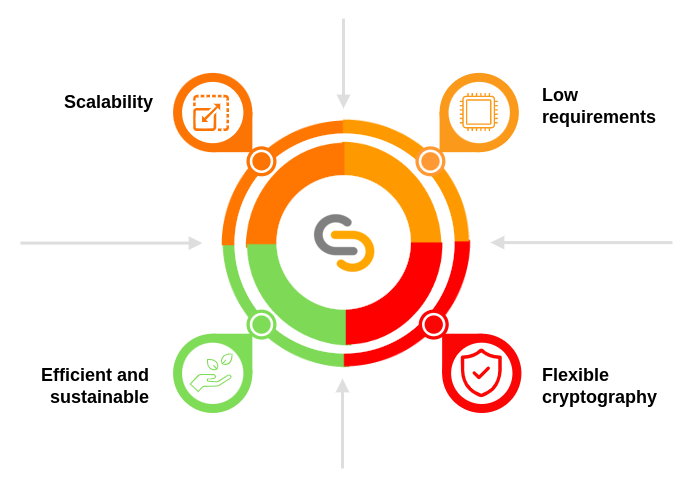
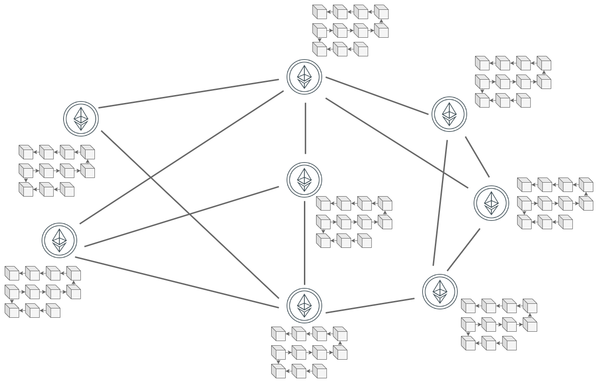
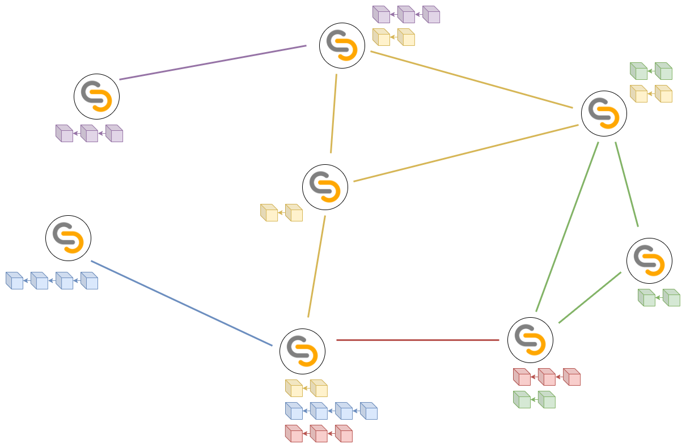

# TAPLE​

TAPLE (pronounced T+🍎 ['tapəl]​) stands for *Tracking (Autonomous) of Provenance and Lifecycle Events​*. TAPLE is a permissioned [DLT](./dlt-blockchain.md#what-is-a-dlt) solution for traceability of assets and processes.

## Objectives
Using Blockchain to try to provide solutions to traceability problems is complex. The number of participants, the heterogeneity of the use cases, the hardware limitations of the devices (IoT) or the difficulty of managing them are some of the challenges to be faced. 

TAPLE was created to address these problems and focuses on meeting the following objectives:

* Scaling to a sufficient level for traceability use cases. This implies both that the network supports such scalability, and that its configuration mechanisms allow it to be a simple process to perform and maintain.
* Support resource constrained devices.
* Have a flexible and adaptable cryptographic scheme mechanism for a multitude of scenarios, including PQC.
* Sustainable and efficient from the point of view of energy consumption.

## TAPLE approach
TAPLE has been designed to meet the objectives presented above. This is achieved through certain properties that allow information to be divided into multiple chains, each associated with an asset in the network and managed only by a single node (understood as its owner). This role allows it to define how the chain evolves without requiring any consensus, although its capacity to intervene in the network is contained by a series of rules previously negotiated by the nodes participating in a use case.

Each of these characteristics will be discussed in more detail in the following sections.

### Partitioning of the ledger by assets
In conventional blockchain, such as Ethereum or Bitcoin, we are used to the existence of a single chain or Ledger where each of its elements corresponds to a block of transactions. These transactions are simply the different write operations, and consequently state modifying ones, that have occurred since the last recorded block, although there is also the possibility that empty blocks are generated, without any transaction. Regardless of the case, as these blocks are generated, they are transmitted to the other nodes of the network to ensure that all participants have the same chain and, consequently, share the same state.

Although this approach has proven to be functional, it has two main problems. First, the fact that each node in the network operates on the same chain implies that all nodes are forced to store transactions that are not of interest to them, subjecting them to workload and resource consumption, especially secondary memory. Second, the more nodes share the same chain, the more difficult it is to guarantee security (including privacy) and consensus features while trying to maintain a certain scalability. The aforementioned [blockchain trilemma](https://academy.binance.com/en/articles/what-is-the-blockchain-trilemma).

In TAPLE there is not a single chain, but as many as the principle used for its definition determines. In our case there would be as many chains as assets to be tracked, this is known as partitioning in ***microledgers***. Note that this would imply that the number of chains could vary at runtime as new assets are defined and added to the network. The network participants decide which assets they are interested in and "subscribe" to them, receiving the chain of events of their life cycle up to that moment and any new events generated thereafter. If they are not generated, the chain remains unchanged for as long as necessary. Likewise, interest in an asset does not have to be constant, so a user could decide to disassociate himself from it even if its life cycle continues, ceasing to receive any updates from it.

This partitioning drastically reduces the amount of information that each node works with and limits the interaction between nodes to only network members with common interests, simplifying and reducing the transmission of messages.

### Ledger single ownership model
In blockchain networks, tens, hundreds or thousands of nodes are connected and it is necessary that they all share and agree on the same information. In the moment a set of nodes do not agree, a bifurcation or branching of the network occurs, basically a split in which the global state differs from that of the original chain. This is a situation that blockchains are trying to avoid, since it would violate the single truth principle and give rise to uncertain scenarios. A blockchain network that is prone to these situations and that also lacks the ability to recover (reorganizations) ends up losing its usefulness. This need is known as consensus and there are various techniques, called ***consensus mechanisms*** to implement it and they intervene mainly at the moment when new content needs to be added to the chain.

In TAPLE, the above problems do not arise because consensus mechanism is not required, since each of the different chains that exist in the network has an owner who is the only one capable of making modifications to it, being his responsibility to determine the order of the operations to the asset. This means that it is possible to modify a subject from any other node in the network, thus avoiding inconsistency in the chains and the need to reach a consensus. However, there is a problem with this single ownership model, and that is that the owner cannot be prevented from acting maliciously. This is not with respect to the validity of the data, since such a situation cannot be checked due to lack of knowledge of the real world, but because it attempts to share different information to different nodes in the network. TAPLE is aware of this possibility and to counteract it introduces the trust model based on validators explained in the next point.

### Trust model based on stakeholder validators
Como ya se ha mencionado, el modelo de propiedad única no puede, por sí solo, evitar que el propietario se comporte de forma maliciosa. Por ello, es necesario establecer mecanismos adicionales que garanticen la consistencia de la información entre todos los nodos interesados en un activo. Esta responsabilidad recae en dos tipos de nodos diferentes:

- Validadores: Estos nodos no poseen una copia completa de la cadena,  ni validan que sea correcta, pero sí garantizan su unicidad, lo que permite acelerar los tiempos de validación. Si la validación tiene éxito, los nodos generan una firma que representa dicho evento y la comparten con los nodos testigos.
- Testigos: Estos nodos mantendrán una copia de la cadena de un activo (los validadores pueden variar según el activo) y deben recibir los eventos de actualización generados por los propietarios. Su principal responsabilidad consiste en validar la legitimidad de la cadena. Para ello, deben verificar que las firmas de los validadores sean correctas y suficientes, además de validar que el resto del evento cumple con la gobernanza y que es criptográficamente correcto, como por ejemplo, validar las firmas de los evaluadores.

### Governance supported by rules
In TAPLE, a set of rules are defined to represent a use case in the network. These rules determine which nodes are participants, how roles are assigned, which action capacity is attributed to each node and even which assets define the use case. This set of rules is known as ***governance*** and is the first step in the functional use of the technology. It is important to note that there is no single governance in the network, but that they are created dynamically as different use cases are decided. Thus, the same node can be a participant in different governance and, consequently, have access to the assets defined in them.