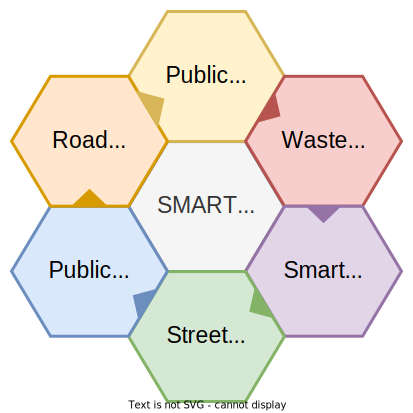

# Use cases

Taple has been designed with traceability use cases in mind. It is considered that in these use cases the vast majority of events are unilateral, which allows taking advantage of TAPLE's differentiating features, such as ledger single ownership model. Some TAPLE technology use cases will be presented as examples to facilitate understanding.

## Processes

Any process that requires traceability with high levels of security and confidence, is apt to be a suitable use case to be traced through TAPLE nodes, for instance, the water cycle. This process describes how the flow of water starts from a point A and passes through a series of other points until it finally returns to the point of origin, simulating a circular path. Along the way, the water flow passes through various entities and processes that cause its volume to decrease. Simultaneously, at some of these points it is possible to analyze the state of that flow by means of sensors or other systems that allow to obtain and generate additional information of the flow itself.

## Assets

Asset traceability involves tracking and/or monitoring the life cycle of an asset and/or product. This includes both the state of the asset itself and all the processes associated with it. A typical example is food traceability. This is the ability to follow the trace of a food through the entire food chain, starting with the production of the raw material, until its subsequent transformation and distribution. Throughout its life cycle, these pass through different entities and procedures that cause a modification of the product from the initial raw material, giving rise to other new products, in addition, on numerous occasions they are combined with other raw materials, representing only a small percentage of the new products.

## IoT

IoT is defined as [The Internet of things](https://en.wikipedia.org/wiki/Internet_of_things). The Internet of things describes physical objects (or groups of such objects) with sensors, processing ability, software and other technologies that connect and exchange data with other devices and systems over the Internet or other communications networks. For example, the smart city concept has recently been gaining momentum. 

Today, the benefits of a city are not only limited to physical infrastructure, services and institutional support, but also to the availability and quality of communication channels, and the transmission and exploitation of knowledge from these channels to improve and efficiently provide resources to social infrastructures. 

One of the most interesting processes within a smart city, both for its public health implications and its economic nature, is waste management. The first step is to collect the garbage provided by citizens in containers which have sensors or other systems that determine the weight of the container and how full they are. Once the sensor is activated at the value set by the company, the garbage truck picks up the container to take it to the recycling factory, where they are responsible for separating these elements and perform the relevant processes for recycling. Finally, when the process is finished, these materials are put back on sale so that they can be used again and the process explained above is repeated. 

## Tourism

The tourism sector could experience enormous benefits through the implementation of a traceability system. This approach would allow for the systematic collection and analysis of a wide range of data related to tourists' profiles and their preferences when planning and enjoying their trips. A detailed compilation of this data would provide a deeper understanding of the activities tourists choose to undertake, the places they wish to visit and the gastronomic establishments they are most attracted to.

The information needed for this analysis would be provided on a voluntary basis by the tourists themselves, who would have the option to share their data anonymously. Encouraged by the incentives offered, tourists might be willing to actively participate in this process. These incentives could be diverse and customised, with the aim of encouraging participation and rewarding tourists' contribution. Examples of incentives could include exclusive discounts for future tourism activities, special offers on accommodation services or even gifts and acknowledgements from municipalities and local entities in appreciation of specific actions, such as supporting sustainability projects or promoting lesser-known destinations.