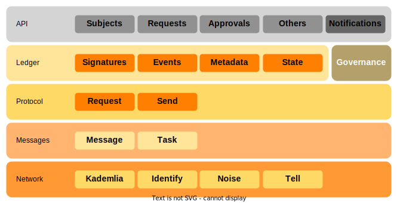

---
# DO NOT REMOVE pagination_next. #fix TAP-1680
pagination_next: learn/core-usage
---
# Core Architecture

TAPLE Core is a library that implements most of the functionality of the TAPLE protocols. The most straightforward way to develop a TAPLE-compliant application is to use this library as, for example, [TAPLE Client](./taple-client.md) does.

Internally, it is structured in a series of layers with different responsibilities. A continuación se presenta una visión simplificada a nivel de capas y bloques de la estructura de TAPLE Core. 

## Network
Layer in charge of managing network communications, i.e., the sending and receiving of information between the different nodes of the network. Internally, the implementation is based on the use of [LibP2P](https://docs.libp2p.io/) to resolve point-to-point communications. For this purpose, the following protocols are used:
- [Kademlia](https://docs.libp2p.io/concepts/fundamentals/protocols/#kad-dht), distributed hash table used as the foundation of peer routing functionality.
- [Identify](https://docs.libp2p.io/concepts/fundamentals/protocols/#identify), protocol that allows peers to exchange information about each other, most notably their public keys and known network addresses.
- [Noise](https://docs.libp2p.io/concepts/secure-comm/noise/), encryption scheme that allows for secure communication by combining cryptographic primitives into patterns with verifiable security properties.
- Tell, asynchronous protocol for sending messages. Tell arose within the development of TAPLE as an alternative to the [LibP2P Request Response](https://docs.rs/libp2p-request-response/latest/libp2p_request_response/) protocol that required waiting for responses.

## Messages
Layer in charge of managing message sending tasks. The TAPLE communications protocol handles different types of messages. Some of them require a response. Since communications are asynchronous, we do not wait for an immediate response. This is why some types of messages have to be resent periodically until the necessary conditions are satisfied. This layer is responsible for encapsulating protocol messages and managing forwarding tasks.

## Protocol
Layer in charge of managing the different types of messages of the TAPLE protocol and redirecting them to the parts of the application in charge of managing each type of message.

## Ledger
Layer in charge of managing event chains, the micro-ledgers. This layer handles the management of subjects, events, status updates, updating of outdated chains, etc. 

## Governance
Module that manages the governances. Different parts of the application need to resolve conditions on the current or past state of some of the governance in which it participates. This module is in charge of managing these operations.

## API
Layer in charge of exposing the functionality of the TAPLE node. Subject and event queries, request issuance or approval management are some of the functionalities exposed. A notification channel is also exposed in which different events occurring within the node are published, for example the creation of subjects or events.