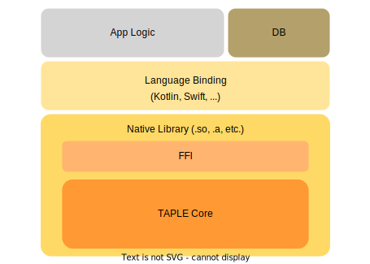

# FFI

TAPLE has been designed with the intention that it can be built and run on different architectures, devices, and even from languages other than Rust. 

Most of TAPLE's functionality has been implemented in a library, TAPLE Core. However, this library alone does not allow running a TAPLE node since, for example, it needs a database implementation. This database must be provided by the software that integrates the TAPLE Core library. For example, TAPLE Client integrates a [LevelDB](./taple-client.md#database) database.

However, in order to run TAPLE on other architectures or languages we need a number of additional elements:
- Expose an Foreign Function Interface (FFI) that allows interacting with the TAPLE library from other languages.
- Target language bindings. Facilitating interaction with the library.
- Ability to cross-compile to the target architecture.

:::info

Explore the TAPLE [repositories](https://github.com/search?q=topic:taple+topic:ffi+org:opencanarias++fork:true+archived:false&type=repositories) related to FFI for more information.

:::
