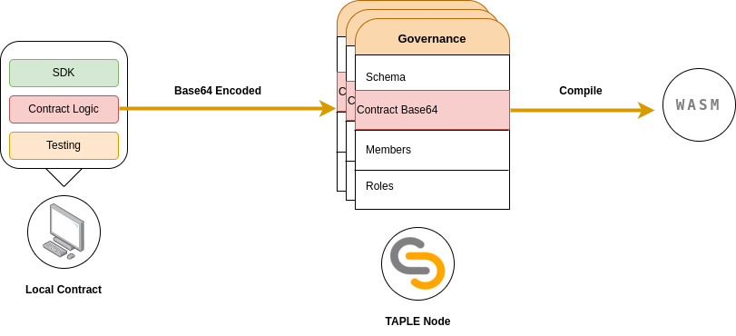

# Smart Contracts in TAPLE

## Smart contracts & schemas
En TAPLE cada sujeto está asociado a un [esquema](../discover/schemas.md) que determina, fundamentalmente, sus propiedades. El valor de dichas propiedades prodrá cambiar con el tiempo a través de la emisión de eventos, siendo necesario, en consecuencia, establecer el mecanismo a través del cual estos eventos realizan tal acción. En la práctica, esto se gestiona mediante una serie de reglas que constituyen lo que denominados un [contrato inteligente](../discover/smart-contracts.md).

En consecuencia, podemos afirmar que un esquema posee siempre un contrato inteligente asociado que regula cómo este evoluciona. La especificación de ambos se realiza en la gobernanza y no concretar uno estando el otro provocará la generación de un evento fallido.

## Entradas y salidas

Los contratos, aunque se especifican en la gobernanza, solamente son ejecutados por aquellos nodos que tengan capacidades de evaluación y, así mismo, que se hayan definido como tales en las reglas de la gobernanza. Resulta importante destacar que TAPLE permite que un nodo actúe como [evaluador](../discover//roles.md#evaluator) de un sujeto aunque este ***no posea la cadena del mismo***, es que decir, aunque no sea [testigo](../discover//roles.md#witness). Esto ayuda a reducir la carga de estos nodos y contribuye al rendimiento general de la red.

Para lograr la correcta ejecución de un contrato, este recibe tres entradas: el estado actual del sujeto, el evento a procesar y un flag que indica si la ejecución del contrato está siendo o no realizada por el propietario del sujeto. Una vez recibidos dichos datos, el contrato debe utilizarlos para generar un nuevo estado válido. Nótese que la lógica de esto último recae completamente en el programador del contrato. Este, además, también determina qué eventos son válidos, o lo que es lo mismo, decida la ***familia de eventos a emplear***. Así, el contrato solo aceptará eventos de dicha familia, rechazando todos los demás y el usuario puedo ajustar los datos de los mismos a las necesidades de su escenario de uso. A modo de ejemplo, supóngase un sujeto que representa el pérfil de un usuario con su información de contacto además de su identidad; un evento de la familia podría ser uno que solamente actualizase el número de teléfono del usuario. Por su parte, el flag puede ser considerado para restringir ciertas operaciones a únicamente el propietario del sujeto, pues la ejecución del contrato se realiza tanto con los eventos que este genera por su propia cuenta como por invocaciones externas.

Destacar, además, que los eventos de la familia pueden ser subconjuntos de los eventos reales, de tal manera que el contrato ignora los campos adicionales para la ejecución de sus cálculos, pero estos igualmente se almacenan en la cadena de eventos. Esto puede ser interesante en algunos casos de uso en los que una porción dela información no es necesaria para generar un nuevo estado pero que igualmente interesa almacenar en la cadena.

Cuando un contrato se termina de ejecutar, este genera tres salidas:
- **Flag de éxito**: Mediante un booleano se indica que si la ejecución del contrato ha sido éxitosa, en otras palabras, si el evento debería provocar un cambio de estado del sujeto. Este flag se mantendrá a falso siempre que se produzca un error en la obtención de los datos de entrada del contrato o bien, si la lógica del mismo así lo dictamina. En otras palabras, se puede y se debe establecer explicítamente si la ejecución se puede ser considerada o no como éxitosa. Esto es importante debido a que estas decisiones dependen en su totalidad del caso de uso, del que TAPLE se abstrae en su totalidad. Así, por ejemplo, el programador podría determinar que si, tras la ejecución de un evento, el valor de unas de las propiedades el sujeto a superado un umbral el evento no pueda ser considerado como válido.
- **Estado final**: Si el evento se ha procesado con éxito y la ejecución del contrato se ha marcado como exitosa, entonces este retorna el nuevo estado final generado, que en la práctica podría ser el mismo que el anterior incluso. No obstante, téngase en cuenta de que no todos los estados son válidos, solamente aquellos que cumplan con el esquema pueden ser considerado como tales. A tal fin, el evaluador, tras la ejecución del contrato, valida el estado obtenido contra el propio esquema definido en la gobernanza, anulando el flag de éxito si la validación no se resuelve con éxito.
- **Flag de aprobación**: El contrato debe decidir si un evento debe ser o no [aprobado](../discover/roles.md#approver). Nuevamente, esto dependerá enteramente del caso de uso, siendo responsabilidad del programador establecer cuando es necesario. De esta manera, la aprobación se establece como una fase opcional pero también **condicional**.

## Consideraciones adicionales
Los contratos de TAPLE funcionan sin ningún estado asociado, en otras palabras, los cambios que produzcan en cualquier variable no se guardarán para futuras ejecuciones del mismo. En su lugar, cualquier dato debe proceder de los parámetros de entrada y en caso de interesar algún tipo de persistencia se debe recurrir a las propiedades del sujeto. Esto es diferencia fundamental de los contratos de TAPLE con respecto a otros como los de Ethereum, en los que la persistencia de datos sí es posible.

## Life cycle

Los contratos deben formalizarse en un proyecto local de **Rust**, único lenguaje permitido para la escritura de los mismos. Dicho proyecto debe de importar el **SDK** de los contratos disponible en los repositorios oficiales y, además debe seguir las indicaciones especificadas en ["cómo redactar un contrato"](./smart-contracts-programming.md). Es recomendable definir una batería de test para probar el contrato antes de darlo por finalizado.

Para poder ser utilizado, el contrato (sin compilar, el código fuente) debe ser codificado en ***base 64*** y, mediante una petición de actualización de la gobernanza, incluirlo en la misma. Este contrato deberá ir acompañado del esquema con el que se relaciona.

:::caution
Debido a que los nodos TAPLE son los encargados de la compilación de contratos, es necesario que el ***base 64*** incluya el contrato en su totalidad. En otras palabras, el contrato debería escrbirse enteramente en un único fichero y este codificado.
:::

Si la petición de actualización es correcta, el estado de la gobernanza cambiará y los nodos evaluadores compilarán el contrato como un módulo de **Web Assembly**, lo serializarán y lo guardarán en su base de datos. La compilación se realiza creando un proyecto de Rust en una ruta especificable en el arranque del nodo. En dicha ubicación se escribirá un fichero con el contenido del base 64 y se procederá al proceso de compilación. Téngase en cuenta que esto limita las librerías utilizables a tan solo el SDK y a serde/serde_json, las librerías de serialización y deserialización por excelencia en Rust. Tras esto, el contrato puede ser utilizado.

La ejecución del contrato se realizará en un **Runtime** de Web Assembly, aislando su ejecución del resto del sistema. Esto evita el uso indebido de los recursos del sistema, añadiendo una capa de seguridad.

La creación de un contrato debe realizarse primeramente en un proyecto local de **Rust**

## Rust and WASM

Se elegió Web Assembly para la ejecución del contratos debido a sus características y rendimiento. Se trata de un lenguaje que permite ejecutar código muy eficientemente gracias a su cercanía al lenguaje máquina. Así mismo, se trata de una alternativa que ya se encuentra extendida en la comunidad, especialmente web, donde se emplea para la ejecución de código complejo, dando mejores rendimientos que JavasScript. Así mismo, su ejecución en entornos aíslados y seguros permite limitar las acciones de un posible atacante, convirtiéndolo en una buena alternativa para ejecutar código en tiempo real y proveniente este de usuarios externos cuyas intenciones no están confirmadas y con los cuales no se puede establecer ningún nivel de confianza válido.

Asi mismo, la compilación a Web Assemly puede realizarse desde múltiples lenguajes, muchos de ellos con una base de usuarios considerable y sus módulos, una vez optimizados, son ligeros.

En lo que respecta a Rust, lo hemos elegido como lenguaje para escribir los contratos de TAPLE debido a su capacidad para compilar a Web Assembly así como por sus capacidades y especificaciones, mismo motivo que el que motivo su elección para el desarrollo de TAPLE. En concreto, Rust es un lenguaje centrado en la redacción de código seguro y de alto rendimiento, cuestiones que contribuirán a la calidad del módulo Web Assembly resultante. Así mismo, el lenguaje cuenta, de manera nativa, con los recursos para crear tests, cuestión que favorecerá el testeo de los contratos.
