# Smart Contracts in TAPLE

## Smart contracts & schemas
En TAPLE cada sujeto está asociado a un [esquema](../discover/schemas.md) que determina, fundamentalmente, sus propiedades. El valor de dichas propiedades prodrá cambiar con el tiempo a través de la emisión de eventos, siendo necesario, en consecuencia, establecer el mecanismo a través del cual estos eventos realizan tal acción. En la práctica, esto se gestiona mediante una serie de reglas que constituyen lo que denominados un [contrato inteligente](../discover/smart-contracts.md).

En consecuencia, podemos afirmar que un esquema posee siempre un contrato inteligente asociado que regula cómo este evoluciona. La especificación de ambos se realiza en la gobernanza.

## Entradas y salidas

Los contratos, aunque se especifican en la gobernanza, solamente son ejecutados por aquellos nodos que tengan capacidades de evaluación y, así mismo, que se hayan definido como tales en las reglas de la gobernanza. Resulta importante destacar que TAPLE permite que un nodo actúe como [evaluador](../discover//roles.md#evaluator) de un sujeto aunque este ***no posea la cadena del mismo***, es que decir, aunque no sea [testigo](../discover//roles.md#witness). Esto ayuda a reducir la carga de estos nodos y contribuye al rendimiento general de la red.

Para lograr la correcta ejecución de un contrato, este recibe tres entradas: el estado actual del sujeto, el evento a procesar y un flag que indica si la petición de evento ha sido emitida o no por el propietario del sujeto. Una vez recibidos dichos datos, el contrato debe utilizarlos para generar un nuevo estado válido. Nótese que la lógica de esto último recae completamente en el programador del contrato. Este, además, también determina qué eventos son válidos, o lo que es lo mismo, decide la ***familia de eventos a emplear***. Así, el contrato solo aceptará eventos de dicha familia, rechazando todos los demás, y que el programar podrá adaptar, en cuanto a su estructura y datos, a las necesidades de su caso de uso. A modo de ejemplo, supóngase un sujeto que representa el pérfil de un usuario con su información de contacto además de su identidad; un evento de la familia podría ser uno que solamente actualizase el número de teléfono del usuario. Por su parte, el flag puede ser considerado para restringir ciertas operaciones a únicamente el propietario del sujeto, pues la ejecución del contrato se realiza tanto con los eventos que este genera por su propia cuenta como por invocaciones externas.

Cuando un contrato se termina de ejecutar, este genera tres salidas:
- **Flag de éxito**: Mediante un booleano se indica que si la ejecución del contrato ha sido éxitosa, en otras palabras, si el evento debería provocar un cambio de estado del sujeto. Este flag se mantendrá a falso siempre que se produzca un error en la obtención de los datos de entrada del contrato o bien, si la lógica del mismo así lo dictamina. En otras palabras, se puede y se debe establecer explicítamente si la ejecución se puede considerar o no como exitosa. Esto es importante debido a que estas decisiones dependen en su totalidad del caso de uso, del que TAPLE se abstrae en su totalidad. Así, por ejemplo, el programador podría determinar que si, tras la ejecución de un evento, el valor de unas de las propiedades el sujeto a superado un umbral el evento no pueda ser considerado como válido.
- **Estado final**: Si el evento se ha procesado con éxito y la ejecución del contrato se ha marcado como exitosa, entonces este retorna el nuevo estado final generado, que en la práctica podría ser el mismo que el anterior incluso. Dicho estado será validado contra el esquema definido en la gobernanza para garantizar la integridad de la información. Si la validación no es existosa, se anula el flag de éxito.
- **Flag de aprobación**: El contrato debe decidir si un evento debe ser o no [aprobado](../discover/roles.md#approver). Nuevamente, esto dependerá enteramente del caso de uso, siendo responsabilidad del programador establecer cuando es necesario. De esta manera, la aprobación se establece como una fase opcional pero también **condicional**.

:::caution
Los contratos de TAPLE funcionan sin ningún estado asociado. Toda la información con la que pueden trabajar es la que reciben de entrada. Esto quiere decir que el valor de las variables no se conserva entre ejecuciones, marcando una diferencia importante con respecto a los contratos inteligentes de otras plataformas, como Ethereum.
:::

## Consideraciones adicionales
Los contratos de TAPLE funcionan sin ningún estado asociado, en otras palabras, los cambios que produzcan en cualquier variable no se guardarán para futuras ejecuciones del mismo. En su lugar, cualquier dato debe proceder de los parámetros de entrada y en caso de interesar algún tipo de persistencia se debe recurrir a las propiedades del sujeto. Esto es una diferencia fundamental de los contratos de TAPLE con respecto a otros como los de Ethereum, en los que la persistencia de datos sí es posible.

## Life cycle

## Desarrollo

Los contratos se definen en proyectos locales de Rust. único lenguaje permitido para la redacción de los mismos. Estos proyectos, que debemos definir como librerías, han de importar el **SDK** de los contratos disponible en los repositorios oficiales y, además, deben seguir las indicaciones especificadas en ["cómo redactar un contrato"](./smart-contracts-programming.md).

## Distribución

Una vez definido el contrato, este ser incluído en una gobernanza y asociado a un esquema para que pueda ser empleado por los nodos de una red. A tal fin, es necesarior realizar una operación de actualización de gobernanza en la que se incluya el contrato en el apartado correspondiente y codificado en **base64**. De haberse definido una batería de tests, esta no es necesario que se incluya en la codificación.

:::caution
Debido a que los nodos TAPLE son los encargados de la compilación de contratos, es necesario que el ***base 64*** incluya el contrato en su totalidad. En otras palabras, el contrato debería escrbirse enteramente en un único fichero y este codificado.

Se trata de una limitación actual y en el futuro se espera poder ofrecer otras alternativas.
:::

## Compilación

Si la petición de actualización es correcta, el estado de la gobernanza cambiará y los nodos evaluadores compilarán el contrato como un módulo de **Web Assembly**, lo serializarán y lo guardarán en su base de datos. Se trata de un proceso automatizado y autogestionado, por lo que no es necesaria la intervención del usuario en ninguna fase del mismo.

:::info
Actualmente no es posible utilizar cualquier crate en los contratos inteligentes, tan solo se puede emplear una reducida selección entre la que se encuentra el SDK. El listado completo de posibles dependencias lo encontrará en ["cómo redactar un contrato"](./smart-contracts-programming.md).
:::

Tras este paso, el contrato puede ser utilizado.

## Ejecución

La ejecución del contrato se realizará en un **Runtime** de Web Assembly, aislando su ejecución del resto del sistema. Esto evita el uso indebido de los recursos del mismo, añadiendo una capa de seguridad.

## Rust and WASM

Se utiliza Web Assembly para la ejecución de los contratos debido a sus características:
- Alto rendimiento y eficiencia.
- Ofrece un entorno aíslado y seguro de ejecución.
- Posee una comunidad activa.
- Permite compilación desde varios lenguajes, muchos de ellos con una base de usuarios considerables.
- Los módulos resultantes de la compilación, una vez optimizados, son ligeros.

Se elije Rust como lenguaje para escribir los contratos de TAPLE debido a su capacidad para compilar a Web Assembly así como por sus capacidades y especificaciones, mismo motivo que el que motivó su elección para el desarrollo de TAPLE. En concreto, Rust es un lenguaje centrado en la redacción de código seguro y de alto rendimiento, cuestiones que contribuyen a la calidad del módulo Web Assembly resultante. Así mismo, el lenguaje cuenta, de manera nativa, con los recursos para crear tests, cuestión que favorece el testeo de los contratos.
