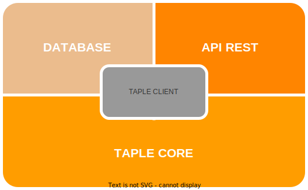

# TAPLE Client

El Cliente de TAPLE es una aplicación gratuita y de código abierto que se ejecuta a través de la línea de comandos. Permite construir un nodo con el que se puede interactuar mediante su API REST.

La estructura del cliente se representa de la siguiente manera:

## TAPLE Core

El núcleo de TAPLE es la tecnología central que se encarga de las comunicaciones de la red. Implementa la codificación y decodificación de la información, interpreta los mensajes recibidos y realiza otras funciones. Para obtener más información, consulte [este recurso](core-architecture.md).

## Database

Este módulo se encarga de almacenar los datos recopilados a través de la red, permitiendo la persistencia de los datos entre las diferentes ejecuciones de TAPLE. Todos los datos se almacenan en una base de datos *Leveldb*. Por lo tanto, se recomienda encarecidamente realizar [copias de seguridad](client-usage#backups) para evitar la pérdida de datos.

## API REST

La API REST es un método de interacción directa con los nodos de TAPLE. Permite realizar acciones como crear y consultar sujetos, ejecutar eventos, aprobar cambios de estado, entre otras. Para obtener más información, consulte [este recurso](../api-rest/create-event-request.api.mdx).