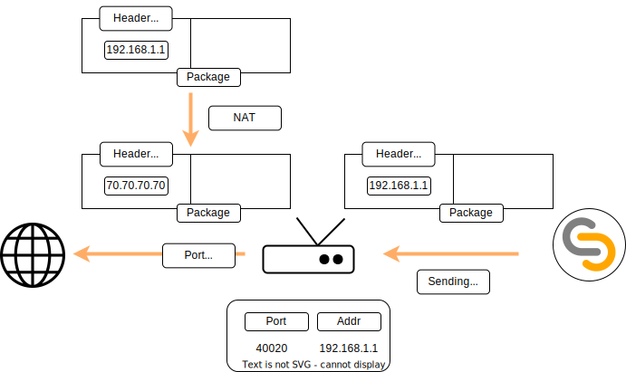
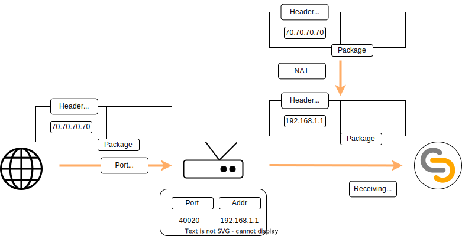
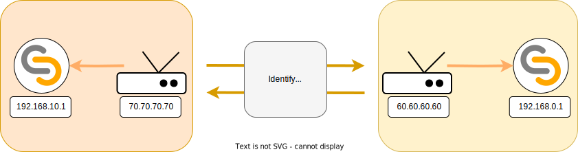

# Internet communications

Communications between TAPLE nodes are carried out via P2P protocol. This means that there are no central nodes channelling communications. While this has great advantages, it also poses certain challenges when communications must be conducted over the Internet. When using taple over the internet, the following issues need to be addressed:
- [Internet communications](#internet-communications)
  - [NAT](#nat)
    - [Outgoing connections](#outgoing-connections)
    - [Incoming connections](#incoming-connections)
  - [Node discovery and routing](#node-discovery-and-routing)

## NAT

Network address translation (NAT) is a method of mapping an IP address space into another by modifying network address information in the IP header of packets while they are in transit across a traffic routing device[^1]. It is mainly used to allow devices on a private network to communicate with other devices over the Internet. Specifically, this mechanism will be responsible for changing in real time the IP addresses of the packets that are sent to the network to a valid public IP known by the router. This IP, which is addressable unlike the private IPs of each device, will in turn allow others to send their own messages to the network, with the router then being responsible for redistributing the traffic if deemed necessary.

[^1]: https://en.wikipedia.org/wiki/Network_address_translation

### Outgoing connections

NAT in itself is not a problem. In fact, it is a solution to the problem of the finite set of IP4 addresses, since it allows a set of devices with private addresses to communicate over the Internet by sharing the same public address. Specifically, when a packet passes through the router, the router changes its IP but also assigns it a port, keeping the relationship between the actual device and the selected port. When an external device wants to issue a response to such an outgoing packet, it must do so by specifying the IP and ports assigned by NAT, so that, on arrival at the router, the router knows how to resolve the addressing.

### Incoming connections

The process for incoming connections works differently, however. While NAT allows responses to outgoing messages, it is not possible for an external device to initiate the communication, i.e. it is not possible to handle incoming messages that are not responses from another device. This is because the router, upon receiving the packet, will not know how to redirect it, since it does not know on which port the device is listening. This implies the need to configure the router to redirect the traffic properly.

:::info
En TAPLE, este comportamiento también es necesario para poder recibir mensajes entrantes.
:::

## Node discovery and routing 
In TAPLE, nodes maintain a routing table that allows them to connect to others in the network. In order to enable its construction, it is necessary for the nodes in the network to know another node in the network beforehand. This is where two LIbP2P protocols come into play: Identify and Kademlia.

The second is the protocol that manages the routing table itself. When two nodes connect, Kademlia includes in its table the relationship that exists between the node identifier and its real address. This allows us to send packets to the nodes knowing only their identifier. Since it is also a routing protocol, it is not necessary for each node to know the entire network. In practice, each node knows a subset and the protocol is responsible for routing packets to those nodes that are not initially in the table.

When two nodes connect to each other, the [Identify](https://github.com/libp2p/specs/blob/master/identify/README.md) protocol acts to produce an initial exchange of information, which is necessary for subsequent communications to be successful and includes, for example, the public keys that the nodes are going to use or their known listening addresses. The latter is especially relevant because it is directly related to the NAT mechanism mentioned above. The node itself is responsible for building the Identify packet with the set of listening addresses, but it does not know its public address and TAPLE does not implement, for the moment, any mechanism to discover it. This means that the packet will consist of the set of private addresses of the node, none of them addressable by an external node, so that even though the discovery process has been completed, in practice the nodes will not be able to communicate with each other, even if the router is properly configured.

LibP2P offers several mechanisms to solve this problem, such as [AutoNAT](https://docs.libp2p.io/concepts/nat/autonat/) or [Hole Punching](https://docs.libp2p.io/concepts/nat/hole-punching/). However, in TAPLE we have chosen to modify the ***Identify*** packages to include a number of external interfaces that can be specified by the user through the node configuration itself. In order to be more precise, a user configures his router to forward traffic received on a port to a device within a private network with a TAPLE node and, through this [configuration](./client-config.md) variable called ***External Address***, specifies the address and port previously configured in the router. Thus, this information will be transmitted to the rest of the network nodes through the Identify protocol and they will be able to send their packets appropriately.

:::note
Currently, these external addresses can only be specified at node startup and during node execution.
:::