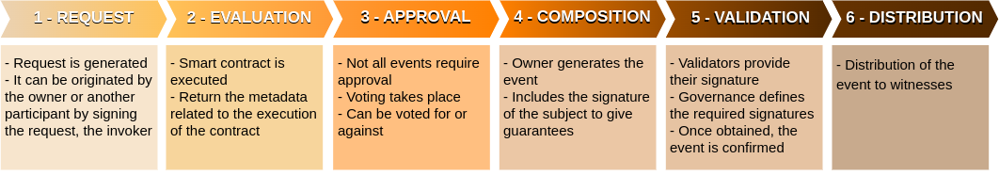
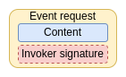
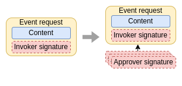
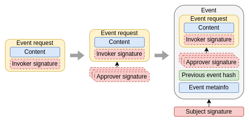
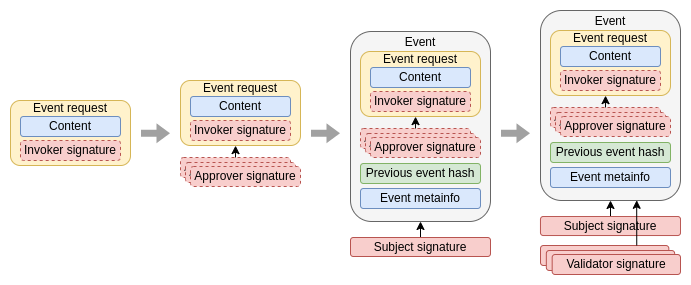

# Event life cycle

The event life cycle is composed of 5 stages, from its request for generation to its distribution.

## Event request 
To change the state of a subject it is necessary to add an event to its microleger. To do so, the first step is to generate an event request. In TAPLE [only the owner of the subject can generate events on the subject](./subjects#ownership-model). However, these events can be generated by requests from other participants, known as **invokers**. In this way, the owner acts as the organizer of the event requests, which can be generated by himself or by other participants.  

:::caution Important

Being the only one who can input events into the micro-logger, the owner has the final say on whether or not to create an event from a request, even if it is sent by another participant. In situations where assurance that the request has been recorded is necessary, additional security measures beyond those offered by TAPLE must be implemented.

:::

Event requests are simple data structures that include the identification of the subject to be modified, the content of the modification and the identification and signature of the invoker.

:::info

Currently the TAPLE P2P protocol does not support sending event requests to the owner of a subject, having to use other mechanisms, such as the REST API. This feature will be supported in future versions.

:::

## Event approval
Some types of events, in order to be accepted by the other participants, need to include a number of additional signatures from other participants, the approvers. These approvers sign for or against an event petition. The rules defined in the governance indicate which signatures are necessary for an event petition to be approved and, therefore, for an event to be generated from this petition. 

:::tip

Remember, not all event requests require approval signatures, so this phase is not always carried out. 

:::

:::info

If you want to know more details about the event approval process visit [this page](./event-approval-process.md).

:::

## Event generation
The next step is the effective generation of the event. The event is composed including the request, the signatures of the approvers, the hash of the previous event and a series of metadata associated with the event. The event is signed then with the subject's cryptographic material, providing assurance that only the owner of the subject was able to generate the event.

## Event validation
A generated event cannot be distributed directly. The reason is that the other participants in the network have no guarantee that the owner has not generated different versions of the event and distributed these versions according to his own interests. To avoid this, the validation phase arises. A number of network participants, the validators, provide their signature to the event, guaranteeing that a single event exists. Not all subjects, nor all events, require the signatures of the same validators. Governance defines which participants must provide their signatures and how many signatures are required. The number of signatures will depend on the use case and the network's trust in the members acting as validators. Unlike the approval phase, validation signatures are automatic. 

## Event distribution
Once there are enough validation signatures, the event is complete and can be distributed to the rest of the network participants. They will only check that the signatures included with the event are correct and that they comply with the requirements established in the governance.