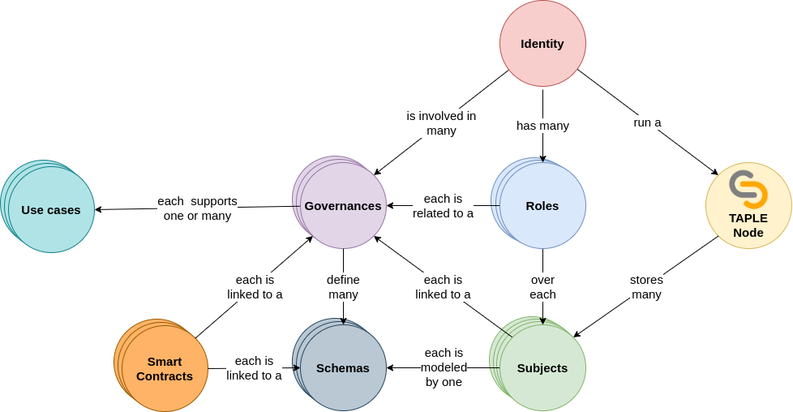
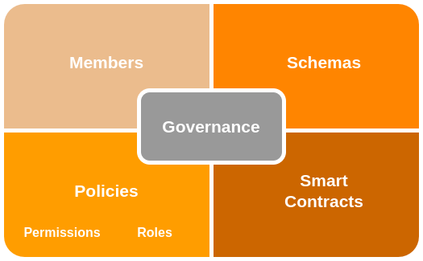

# Governance
In this page we will describe the governance functionally. If you want to know how to define a governance to adapt it to your needs visit the [governance configuration](../develop/operational-guides/governance-configuration.md) page. 

A TAPLE network does not consist of a single ledger, but potentially multiple [microledgers](./subjects.md#microledger) stored within subjects. The management of these subjects requires the definition of mechanisms to facilitate this task in batch, not individually for each one, which can be created dynamically.

Governance is the set of rules that define how the various participants in a TAPLE network interact with each other and their relationship with the subjects.

Governance is responsible for defining: 
- the participants of one or more use cases; 
- the schemes that are allowed to be used; 
- the permissions that each participant has to operate in the network;
- and the roles that they will have over each subject.  

:::caution Important

TAPLE governance is under active development. The current release does not include all planned functionality, for example, the definition of rules based on namespaces of interest. Future versions will include these capabilities.

:::

## Subjects, nodes and governances

Governance defines the rules to be followed in a use case. However, a holder of a TAPLE node is not limited to participate in a single use case. For this reason, the following hierarchy of relationships appears:
- A person, entity or organization owns an [identity](./identity.md).
- A TAPLE node is executed representing that identity.
- An identity can be involved in several governance.
- Each governance supports one or many use cases.
- In each governance, the identity can have different roles, applied on different subjects.
- Each TAPLE node can store multiple subjects.
- Each subject is linked to a governance.

## Components
Governance is structured into the following components: members, schemas and policies

### Members
These are the persons, entities or organizations that participate in the governance and therefore may be part of the use cases that are supported. Each member declares a unique identifier that represents the cryptographic material with which it will operate in the network.

### Schemas
Schemas are the data structures that model the information stored in the subjects. Within a governance, different schemas can be defined to support different use cases. When a subject is created, it defines which governance it is associated with and which schema it will use. 

### Policies
Policies are the rules by which we define permissions and roles, i.e. who is allowed to do what things in a TAPLE network. 

:::caution

As we know, the owner of a subject [is the only one who can act on it](./subjects.md#ownership-model), and therefore has absolute freedom to modify it. Governance cannot prevent malicious owners from attempting to perform forbidden actions, but it does define the conditions under which the rest of the participants ignore, or penalize, these malicious behaviors. 

:::

## Governance as a subject
Within the TAPLE network, the governance that governs it is managed as a subject, using the same protocol as the rest of the subjects for its [generation, approval, validation and distribution](../technology/event-life-cycle.md). The subjects modeling governance meet the following conditions: 
- Are created using the governance scheme. This schema does not belong to any member of the network and is defined internally in TAPLE protocol.
- When a generic subject is created, the associated governance is specified. Conversely, when creating a subject intended to model a governance, no value is specified.
