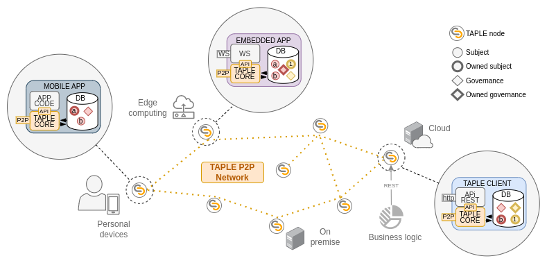

# Overview
The following diagram shows the usual elements of a TAPLE network. A brief description of each of them is given below so that we can obtain an overview before going into more detail.

## TAPLE Core
It is the library that implements most of the TAPLE functionality. Any application that wants to be part of a TAPLE network must make use of this library from the API it exposes. Some of its functions are:
- Creation and management of [subjects](./subjects) and their associated [microledgers](./subjects#microledger) 
- Implementation of the [P2P](./glossary#p2p) protocol for communication between nodes.
- Database persistence

:::caution Important

TAPLE Core is not a stand-alone application that can be run directly, but a library that has to be used from some application. See [TAPLE Client](#taple-client).

:::

## TAPLE Node
Running instance of an application that uses the TAPLE Core and therefore implements the TAPLE communication protocol and can be part of a TAPLE network and exchange information with other nodes. 

### Identity
Each TAPLE node is associated with **a unique identity** representing its owner. However, the same identity can be associated with different governance in order to participate in different use cases. Based on the owner's needs and level of commitment, the identity can act in different roles within the network. 

:::info

To learn more about identity visit this page: [Identity](identity).

:::

## TAPLE Client
Official client to create a TAPLE Node. It is the easiest way to work with TAPLE as it is a simple console application that provides everything needed to build a node. Some of its functions are:
- Use the TAPLE Core 
- Implements a Rest API to interact with the TAPLE network in a simple way
- Allows configuration by different mechanisms: configuration files, start-up parameters and environment variables

:::info

To learn more about TAPLE Core and TAPLE Client visit those pages: [TAPLE Core](../develop/taple-core), [TAPLE Client](./../develop/taple-client-config.md).

:::

## Subjects
TAPLE implements a ledger partitioning mechanism based on subjects. Subjects are logical entities that represent an asset or process within a TAPLE network. In this way, instead of all participants having the same string, each participant stores only the subjects in which it is interested. Each subject stores the information in a small ledger, known as [microledger](./subjects#microledger). 

:::info

To learn more about subjects visit this page: [Subjects](./subjects).

:::

### Owned subjects
There is only one owner for each subject, being the only one with the effective capacity to make changes to the subject. All other participants wishing to make a change in a subject must send the owner an event request. 

## Events 
The microledger is a structure of chained events. Each of these events models any fact that we want to store associated with that subject, such as a modification of its properties or even its creation. 

:::info

To learn more about the events visit these pages: [Events](./events) and [Events lifecycle](./event-life-cycle).

:::

## Governances
Governance is the definition of the rules of cooperation of the different network participants within the same use case. It defines the participants of the use case, the types of subjects and their structure, and the rules that define the permissions and roles of the different participants. The same node, and therefore the same identity, can act with different roles in different governance but also within the same governance.

### Owned governances
Within the TAPLE network, governance is managed as a special type of subject. Therefore, like any other subject, they have a single owner.

:::info

To learn more about structure and functionality of the governances visit this page: [Governance](./governance).

:::