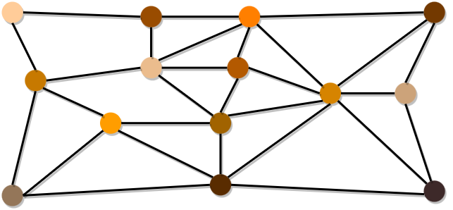
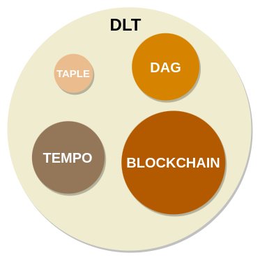
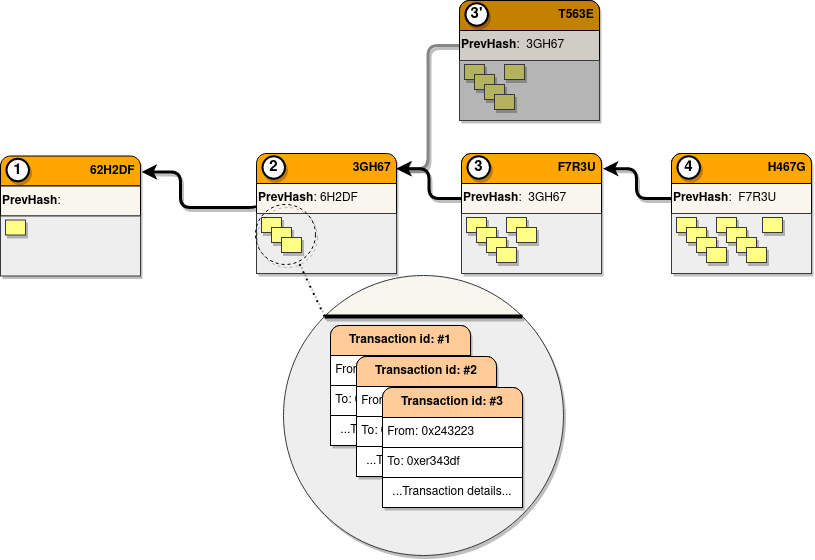
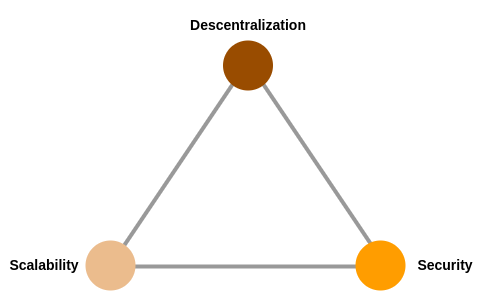

# DLT and Blockchain

## What is a DLT?

DLT stands for *Distributed Ledger Technology*, but, ¿what is really a DLT?. There are many definitions of DLT, but let's try to explain it in a simple way.
A [ledger](https://en.wikipedia.org/wiki/Ledger) is an accounting concept that basically defines a ledger in which information is always being added, usually in the form of transactions. These transactions are never deleted or modified, however, the result of these transactions can be modified by adding new transactions.
A DLT is nothing more than a database that acts as such a ledger but also has, to a greater or lesser extent, the following characteristics:
- It is distributed and decentralised. The information is not located at a single point, but is distributed in a network of nodes in which there is usually no established hierarchy, all nodes being equal, or at least capable of offering the same capabilities to the network. Therefore, any node could talk to any other node.
- Shared. Usually not all nodes are under the control of the same organisation. This makes it necessary to assume that there could be malicious nodes within the network and, therefore, to establish security mechanisms. Moreover, not all nodes would have to have exactly the same information, as there could be private transactions, or simply different interest groups.
- Immutable and tamper-resistant. It implements cryptographic security mechanisms that prevent its content from being altered, or at least, if any node tries to modify the information, it can be easily detected and blocked.

:::info

What do some international organizations understand by DLT:
- [UK Goverment](https://www.gov.uk/government/news/distributed-ledger-technology-beyond-block-chain)
- [International Telecomunication Union](https://www.itu.int/en/ITU-T/focusgroups/dlt/Pages/default.aspx)
- [European Parliament](https://www.consilium.europa.eu/media/53681/st14993-en21.pdf)

:::

### Types of DLT networks
DLT networks can be classified according to the type of access to the network itself and its information. Thus, according to the type of access we find: 
- Public networks. Those in which anyone can join and participate.
- Private networks. With the same elements as a public network, but one or several organisations are in charge of administering the network and controlling who is allowed to participate.

On the other hand, depending on the access to the information, we find:
- Permissionless networks. These are networks where anyone can request modifications or queries on the information stored in the block.
- Permissioned networks. These are networks where modifications and queries on the information stored in the block of the network members are limited and controlled by a series of permissions that the network administrators (people or organisations) must grant.

## What is a Blockchain?
Blockchain is a subtype of DLT, and therefore we can say that it is fundamentally a distributed, decentralized, shared, and immutable database. 

But blockchain is also characterized by the following:
- It has a data structure in the form of a chain. The information is stored by grouping blocks linked by their cryptographic fingerprints, thus giving rise to a chain system, where a given block stores the reference to its predecessor. This information is encrypted using advanced cryptographic methods, resulting in a block with unique and unambiguous information (the slightest change in any aspect of the block will result in a completely different chain, which will be invalidated by the system).
- The blocks include multiple transactions. As a measure to increase the capacity of networks, blocks typically group different transactions together. Moreover, these transactions do not necessarily belong to the same participant.  
- There is usually a single chain shared by all participants in the network. As it is shared by all participants, the degree of trust in the stored data is very high, giving rise to the concept of *single source of truth* . However, this is associated with very high and equal requirements for all nodes, even if they do not participate actively in the network or do so very little. Some blockchains are trying to solve this problem through partitioning techniques, such as the sharding proposed for Ethereum 2.
- Existence of consensus mechanisms. As there is a single shared chain (or a small group of them), it is necessary to establish mechanisms that prevent simultaneous block generation attempts by different participants from generating different chains. These mechanisms are consensus algorithms. The need for such control mechanisms is often one of the determining factors in the scalability of blockchain networks. 

:::info

Possibly the best known consensus mechanism is ***PoW (Proof of Work)***, used by both Bitcoin ([Bitcoin: A Peer-to-Peer Electronic Cash System](https://bitcoin.org/bitcoin.pdf)) and Ethereum until the release of Ethereum 2.0 ([Ethereum: Proof-of-work](https://ethereum.org/en/developers/docs/consensus-mechanisms/pow/)).

:::

### When do we need a Blockchain?

To summarise, blockchain behaves like a large, distributed, secure and transparent database. These characteristics have meant that the main use cases in which it has been successful are related to the security of transfers of value and ownership. Blockchain allows stored information to be considered an asset and, as such, to have an owner. This feature is commonly known as tokenisation. This has been one of the pillars on which several use cases have been based, the best known being cryptocurrencies, DAOs and NFTs. 

However, Blockchain is a technology that is perfectly suited to other use cases. It is especially interesting in those use cases in which information needs to be shared securely between parties between whom there is not full trust. As it is a common database, in which information cannot be deleted, its level of transparency and trust is very high. Any transaction is always reflected by indicating what was changed, by whom and when. In addition, many blockchain technologies introduce the concept of smart contracts (SC). These SCs are pieces of code that allow certain tasks or calculations to be automated and can be used to implement business logic. In this way, all network participants not only see the same information but are able to react in the same way to any changes in the information. 

Thanks to these capabilities, blockchain has been successfully used in a multitude of areas, such as:
- Logistics
- Finance
- Public services
- Land registry
- Identity

### When do we not?

Like any other technology, blockchain has a number of use cases for which it is, or is not, suitable. The [blockchain trilemma](https://vitalik.ca/general/2021/04/07/sharding.html), proposed by Vitalik Buterin, is represented as a triangle with the following concepts at each vertex:
- Decentralisation, or the network's ability to remain independent of organisations or hierarchical structures, avoiding their possible manipulation;
- Security, or the ability of the network to resist external attacks or data corruption;
- Scalability, or the ability to adapt to ever-increasing demands.

According to this trilemma, it is very difficult to satisfy all three concepts simultaneously, which marks the limits of the use of a blockchain technology. Many blockchain networks try to alleviate this problem, but to do so they need to sacrifice, at least in part, some of their advantages. For example, technologies such as Ethereum are committed to enhancing security and decentralisation, which has a direct impact on their ability to scale. 

:::info

Ethereum 2 intends to increase its scalability by introducing numerous changes to its architecture, for example migration to PoS and Sharding, the partitioning of the chain into 64 shards. However, there are concerns in the community about its possible effects on the security and decentralisation of the network. 

:::

Each use case is unique and it is necessary to assess your specific needs to determine whether it is appropriate to use a blockchain technology, which one, and if not, what alternatives are available, e.g. within other DLTs, for instance [TAPLE](taple.md).

