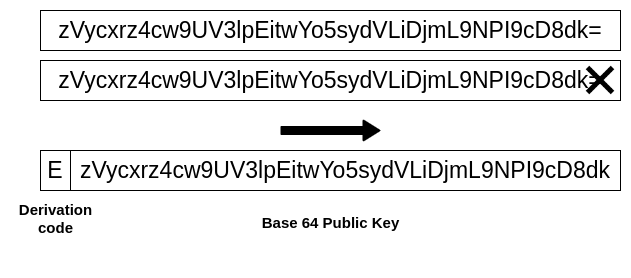

# Identity
Each participant in a TAPLE network has a unique identifier and a private key that allows them to sign the transactions carried out. In addition, depending on their interest in each subject and their level of involvement with the network, each participant will have one or several different roles.

## Identifiers
Given the strong influence of [KERI](https://keri.one/) in TAPLE, the reflection on the reference model to establish the identifiers in our protocol starts from the [Zooko’ triangle](https://en.wikipedia.org/wiki/Zooko%27s_triangle). It is a trilemma that defines three desirable properties in the identifiers of a network protocol, of which only two can be present simultaneously. These properties are:
- Human-meaningful : Meaningful and memorable (low-entropy) names are provided to the users.
- Secure: The amount of damage a malicious entity can inflict on the system should be as low as possible.
- Decentralized : Names correctly resolve to their respective entities without using a central authority or service.

Although several solutions to the trilemma have already been proposed, we have prioritized decentralization and security to apply a design equivalent to the [Ethereum Name Service](https://ens.domains) shortly. Specifically, in our approach, we have considered three types of identifiers, which in turn represent three types of cryptographic material: 
- Public key, the identifier of the participating roles in the network.
- Message digest, the identifier of the content of the messages resulting from applying a hash function to this content
- Cryptographic signature, the identifier of the signatures made by the roles on the messages, which serves as verifiable proof.

### Derivation codes
This cryptographic material is large binary numbers, representing a challenge when used as identifiers. The best way to handle identifiers is through a character string, and for the conversion, we have adopted [Base64 encoding](https://www.rfc-editor.org/rfc/rfc4648), which encodes every 3 bytes of a binary number into 4 ASCII characters. As the cryptographic material being managed is not a multiple of 3 (32 bytes and 64 bytes), it is padded with one additional character (32 bytes) or two (64 bytes). As in KERI, we have taken advantage of these additional characters to establish a derivation code to determine the type of material, placing the derivation character(s) at the beginning. Figure 3 shows this solution.

The following table details the currently supported derivation codes :

| Code | Identifier type          |
| ---- | :----------------------- |
| E    | Ed25519 Public Key       |
| S    | Secp2556k1 Public Key    |
| J    | Blake3 Digest (256 bits) |
| OJ   | Blake3 Digest (512 bits) |
| L    | SHA2 Digest (256 bits)   |
| OL   | SHA2 Digest (512 bits)   |
| M    | SHA3 Digest (256 bits)   |
| OM   | SHA3 Digest (512 bits)   |
| SE   | Ed25519Sha512 Signature  |
| SS   | ECDSAsecp256k1 Signature |

:::info

New types of cryptographic material are already incorporated in the roadmap, thinking of low resource devices and post-quantum cryptography.

:::

## Roles

### Owner
Subject owner participant, who owns one or several subjects. They have total control over the subject because they possess the cryptographic material with permission to modify the subject.

:::tip
Subject ownership can be obtained by creating it or receiving it from the previous owner.
:::

### Approver 
Some event requests require a series of signatures to be approved and become part of a subject's microledger. This signature collection is a voting process where participants can vote in favor or against. These participants, defined in governance, are the approvers.

### Validator
Validators are the participants who provide the [security signatures](./events.md#validators-signature) to the subject. Validators maintain a full copy of the subjects they validate and commit to the network not to accept more than one version of the same event. That is, in the event of a malicious attempt by the subject owner to overwrite an event, the validator will not sign the second event again.

### Witness
Participant interested in having a copy of the subject and the information it stores.

### Invoker
Participant who initiates a request to modify a subject. It can be the owner or another participant with sufficient permissions.