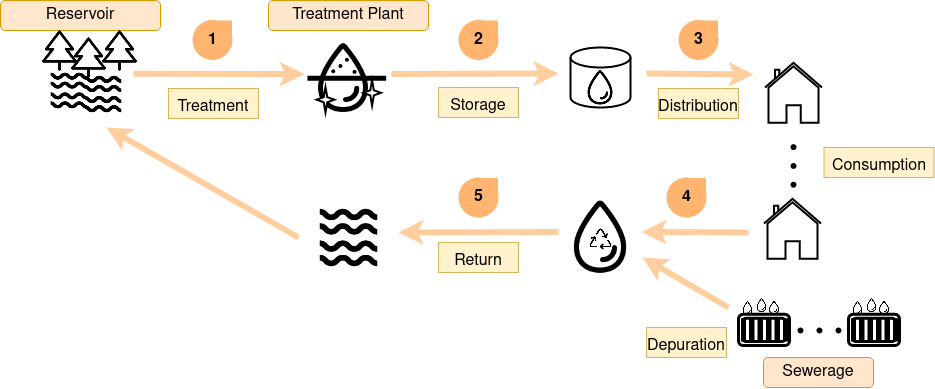
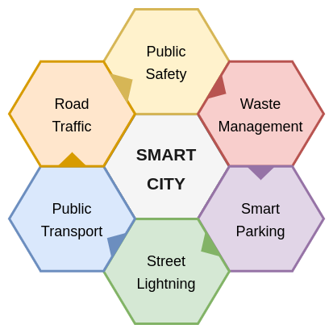

# When to use TAPLE

Some TAPLE technology use cases will be presented as examples to facilitate understanding.

## Traceability of processes

Any process that requires traceability with high levels of security and confidence, is apt to be a suitable use case to be traced through TAPLE nodes. Some example use cases will be presented below.

### Water cycle

The water cycle describes how the flow of water starts from a point A and passes through a series of other points until it finally returns to the point of origin, simulating a circular path. Along the way, the water flow passes through various entities and processes that cause its volume to decrease. Simultaneously, at some of these points it is possible to analyze the state of that flow by means of sensors or other systems that allow to obtain and generate additional information of the flow itself.

### Green hydrogen

Hydrogen production requires energy consumption that can come from different sources, both renewable and fossil fuels. Thus, the distinction of ***green hydrogen*** has been created to highlight hydrogen that is produced solely from renewable energy sources. However, in order to receive this categorization, which is of growing interest in a world increasingly concerned about the environment, it is necessary to provide evidence of the process to prove it.

## Traceability of assets

Asset traceability involves tracking and/or monitoring the life cycle of an asset and/or product. This includes both the state of the asset itself and all the processes associated with it.

### Traceability of food products

This is the ability to follow the trace of a food through the entire food chain, starting with the production of the raw material, until its subsequent transformation and distribution. Throughout its life cycle, these pass through different entities and procedures that cause a modification of the product from the initial raw material, giving rise to other new products, in addition, on numerous occasions they are combined with other raw materials, representing only a small percentage of the new products.

### Traceability of packages

This type of traceability consists of keeping track of the delivery process of a package to the place specified by the user. This process starts from the moment the user purchases a product from an entity, which goes through different stages within the supplier entity until it leaves the warehouse. It will be transported by the same or other entities passing through different stages of control and moving to the delivery destination specified by the user.

## IoT

IoT is defined as [The Internet of things](https://en.wikipedia.org/wiki/Internet_of_things). The Internet of things describes physical objects (or groups of such objects) with sensors, processing ability, software and other technologies that connect and exchange data with other devices and systems over the Internet or other communications networks.

### Smart Cities

Today, the benefits of a city are not only limited to physical infrastructure, services and institutional support, but also to the availability and quality of communication channels, and the transmission and exploitation of knowledge from these channels to improve and efficiently provide resources to social infrastructures. 

One of the most interesting processes within a smart city, both for its public health implications and its economic nature, is waste management. The first step is to collect the garbage provided by citizens in containers which have sensors or other systems that determine the weight of the container and how full they are. Once the sensor is activated at the value set by the company, the garbage truck picks up the container to take it to the recycling factory, where they are responsible for separating these elements and perform the relevant processes for recycling. Finally, when the process is finished, these materials are put back on sale so that they can be used again and the process explained above is repeated. 

