# Event approval process

The approval process consists of the following steps:

- An event request is generated, either by the subject owner or by another network member.
- The subject owner checks whether the event request requires approval by looking at the rules defined in the governance.
- If the request requires it, an approval request is sent to the different approvers.
- Once each approver has the request, they will be able to vote, both for and against, and will send it back to the owner of the subject.
- Every time the owner receives a vote, he will check the following:
  - There are enough positive votes for the application to be accepted.. 
  - There are so many negative votes that it is impossible to get the application approved. 
- In both cases, the owner will generate an event that includes the original request and the result of the vote. In the event that the vote has not been successful, the event will be generated but it will not produce changes in the state of the subject, remaining merely for informational purposes.

:::caution Importante

It is important to remember that the subject owner is the only one who can force an effective change on a subject. Therefore, the owner, after the approval process, could decide whether or not to include the event in the chain. This would not follow the standard behavior defined by TAPLE, but it would not break compatibility.

:::

```mermaid
sequenceDiagram
    %% Comentarios pendientes a que este la invocación externa
    %% actor Invocador
    actor Owner
    actor Approver 1
    actor Approver 2
    actor Approver 3
    %% Invocador->>Owner: Submit an event request
    Note over Owner: Receive event request
    alt Need for approval detected
      Owner->Approver 3: Transmit approval request to all approvers
      Approver 1-->>Owner: Receive
      Approver 2-->>Owner: Receive
      Approver 3-->>Owner: Not receive
      Note over Owner: Wait
      Approver 1->>Owner: Vote yes
      Approver 2->>Owner: vote no
      Note over Owner: Receive vote request
      Owner->>Approver 3: Transmit request
      Approver 3-->>Owner: Receive
      Note over Owner: Wait
      Approver 3->>Owner: Vote yes
      Note over Owner: Receive vote request
    end
    alt Positive quorum
      Owner->>Owner: Generate
    else Negative quorum
      Owner->>Owner: Generate event
    end
    Owner->Approver 3: Event goes to the validation phase
```

:::info

The information of the votes cast is stored within the [event metadata](./events.md)

:::