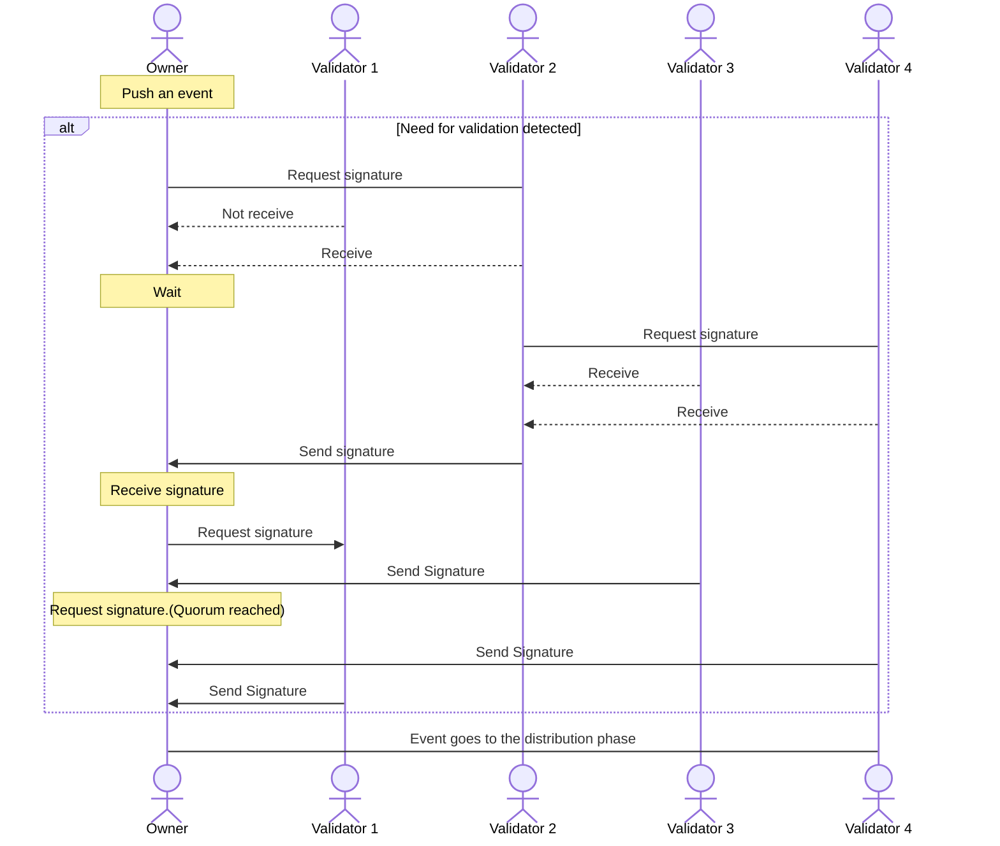

### Validation

En este proceso se da por hecho que va a ocurrir un cambio en el estado del sujeto y , por lo tanto, ahora se requiere que un porcentaje de los participantes (denominado **quorum**) con rol de validador del sujeto definidos como tal en la gobernanza den prueba de:

* Correcto material criptográfico. El evento proviene del propietario del sujeto y no de terceros maliciosos. Así se mantiene la consistencia del microledger.
* Acuse de recibo. De esta forma se conoce que todos han recibido el evento y se mantiene el principio de "verdad única" del microledger entre todos los participantes.

Todo esto lo hacen aportando el material criptográfico propio que generan los nodos TAPLE en el momento en que se inician por primera vez, firmando el evento con él. El proceso para hacerlo es mediante un algoritmo de cascada determinista, por el cual:

1. El propietario del sujeto genera un evento y, a partir de un factor de replicación 'N', indicado por configuración, selecciona 'N' validadores con los que va a comunicarse.
2. A estos 'N' validadores les manda una petición de firmas para que le validen el evento y se le permita modificar el sujeto. Si alguna de estas peticiones no alcanza su destinario, se reintenta la comunicación al cabo de un lapso de unos segundos.
3. Cada uno firma el evento y retorna el evento firmado al propietario.
4. Con el fin de garantizar la comunicación con todos, cada uno de los 'N' validadores seleccionan a su vez a 'M' otros y les reparte el evento.
5. El proceso termina cuando el propietario del sujeto que ha provocado el evento recibe las 'X' firmas que necesita para aprobar el cambio. Este número 'X' viene definido en la gobernanza y se denomina **Quorum**.

A continuación se muestra un diagrama de flujo que detalla lo comentado anteriormente con un ejemplo . Se trabaja con un quorum y factor de replicación del 50%:

