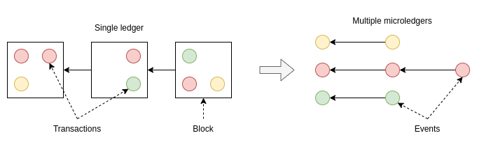
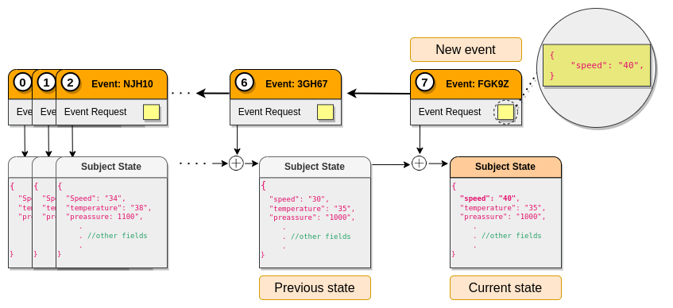

# Subjects

The TAPLE network performs [ledger partitioning](./what-is-taple.md#partitioning-of-the-ledger-by-assets) on a per-subject basis. Instead of having a single ledger shared by all participants, the information is structured on a subject-by-subject basis. Subjects are logical entities that represent an asset or process within a TAPLE network. 

Each subject complies with the following: 

- They contain a single [microledger](#microledger).  
- It has a [state](#subject-state) modelled by a schema. 
- It has a single [owner](#ownership-model).
- It depends on a [governance](#belonging-to-a-governance). 

## Microledger

Each subject contains internally a ledger in which the events that affect only that subject are recorded, the microledger. This microledger is a set of events chained together using cryptographic mechanisms. It is similar to a blockchain in that the different elements of the chain are related by including the cryptographic fingerprint of the immediately preceding element, but, unlike blockchains in which each block can include a set of transactions, possibly from different accounts, in the microledger each element represents a single event of the subject itself.

:::info

To learn more about the microledger structure visit the [Events](./events.md) page.

:::

## Subject state

The state is the representation of the information stored by a subject at a given instant, usually the current moment. It is a data structure, stored with the microledger, which contains the information stored in a subject. The state is obtained by applying, one after the other, the different microledger events on the initial state of the subject defined in its [genesis-event](/docs/technology/events#evento-de-g%C3%A9nesis-genesis-event). 

:::info

The state structure must correspond to a valid schema. To learn more about schemas visit the [Schemas](./schemas.md) page. 

:::

:::caution Important

Unlike other DLTs, TAPLE does not have data tables. The information is stored in a single entity, the subject state. Use cases that require storing a large amount of information have to be approached by partitioning the information into different subjects. 

:::

## Ownership model
Any subject has a single owner, this being the only participant in the network that can make effective modifications to the subject, i.e., enter events in the micro-ledger. However, other participants can generate event requests. These event requests are signed by the invoker and sent to the owner of the subject.

:::info

To learn more about invokers visit the [Event Life Cycle page](./event-life-cycle.md#event-request) page. 

:::
<!--

PENDIENTE DE TERMINAR Y PONER UNA FIGURA EXPLICATIVA. PENDIENTE DE ANALIZAR CODIGO

### Subject Identifier
Cada sujeto tiene un identificador único y una clave privada con la que firmar los eventos de la cadena. El propietario del sujeto es el único que posee esta clave privada. El identificador del sujeto tiene las siguientes características:
- Es único. 
- Esta asociado a la clave privada del sujeto.
- Permite validar su propietario.

Para lograr estas características, el identificador del sujeto se deriva a partir de la petición de evento y de la clave pública de un par de claves generadas para esta labor.
-->

## Belonging to a governance
A subject always exists within a use case. Governance is the definition of the rules by which the use case is governed. What types of subjects can be created or who can create them are some of the rules that are defined in the governance. Although a subject can only belong to one governance, a TAPLE node can manage subjects of different governance, so that the same node can participate simultaneously in different use cases. 

:::info

To learn more about governance and its structure visit the page [Governance](./governance).

:::