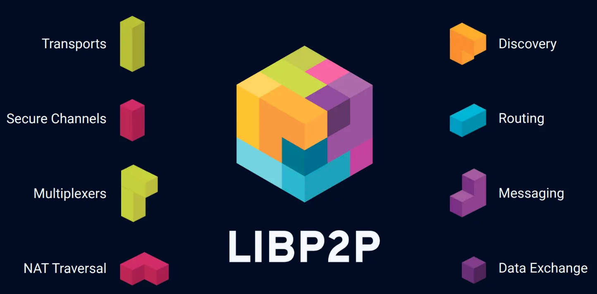

# Under the hood

## Rust
[Rust](https://www.rust-lang.org/) is a programming language initially developed by Graydon Hoare in 2006 while working at Mozilla, company that would later officially support the project in 2009, thus achieving its first stable version in 2014. Since then, the popularity and adoption of the language has been increasing due to its features, receiving support from significant companies in the industry such as Microsoft, Meta, Amazon and the Linux Foundation among others.

Rust is the main language of the TAPLE technology. Its main characteristic is the construction of secure code, it implements a series of features whose purpose is to guarantee [memory safety](https://en.wikipedia.org/wiki/Memory_safety), in addition to adding zero-cost abstractions that facilitate the use of the language without requiring complex syntaxes. Rust is able to provide these advantages without negatively affecting system performance, both from the point of view of the speed of a running process, as well as its energy consumption. In both characteristics, it maintains [performances](https://haslab.github.io/SAFER/scp21.pdf) equal or similar to C and C++.

Rust was chosen as a technology precisely because of these characteristics. From OpenCanarias, we attach great importance to the security of the developed software and its energy consumption and Rust was precisely the language that met our needs. Also, since it is a modern language, it includes certain utilities and/or features that would allow us to advance more quickly in the development of the technology.

## LibP2P
[Libp2p](https://libp2p.io/) is a "stack of technologies" focused on the creation of *peer-to-peer* applications. Thus, LibP2P allows your application to build nodes capable of interpreting a number of selectable protocols, which can be both message transmission and encryption among others. Libp2p goes a step further by offering the necessary tools to build any protocol from scratch or even to create *wrappers* of other existing ones or simply to implement a new high-level layer for a protocol while maintaining its low-level operation. LibP2P also manages the transport layer of the node itself and offers solutions to problems known as ["NAT Traversal"](https://en.wikipedia.org/wiki/NAT_traversal).

LibP2P also places special emphasis on modularity, in such a way that each and every one of the previously mentioned elements are isolated from each other, can be modified without affecting each other and can be combined as desired, maintaining the principle of single responsibility and allowing code reuse. Once a protocol is developed for LibP2P, it can be used in any application regardless of how different they are from each other. This level of modularity allows even different protocols to be used depending on the medium to be used.

LibP2P was chosen for TAPLE because of its innovative approach to the creation of P2P applications through its tools and utilities that greatly facilitate development. It was also influenced by the fact that it is a technology with a background in the Web3 sector, as it was originally part of [IPFS](https://docs.ipfs.tech/concepts/libp2p/) and has been used in [Polkadot and Substrate](https://www.parity.io/blog/why-libp2p) as well as [Ethereum 2.0](https://ethereum.org/es/developers/docs/networking-layer/).

## Tokio
[Tokio](https://tokio.rs/#tk-lib-tokio) is a library for Rust aimed at facilitating the creation of [asynchronous](https://rust-lang.github.io/async-book/01_getting_started/01_chapter.html) and [concurrent](https://doc.rust-lang.org/book/ch16-00-concurrency.html#:~:text=Concurrent%20programming%2C%20where%20different%20parts%20of%20a%20program%20execute%20independently) applications. It provides the necessary elements for the creation of an execution environment for task management, internally interpreted as ["green threads"](https://en.wikipedia.org/wiki/Green_thread) (which Rust does not natively support). As well, as channels for communication between them among. It is also quite easy to use thanks to its syntax focused on "async / await" and has high scalability thanks to the reduced cost of creating and deleting tasks.

Due to the previously mentioned characteristics and focusing on concurrency and scalability, Tokio is an adequate library for the needs you want to cover with TAPLE technology.
