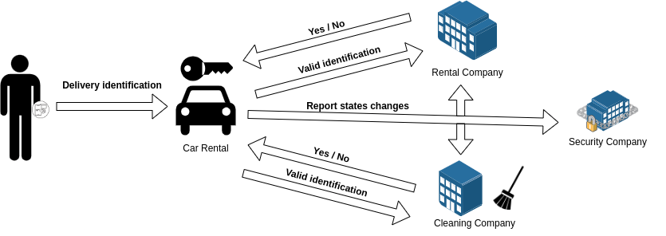

# Use case description

We are a car rental company that wants to have a traceability to the accesses of the vehicles. A vehicle can only be opened by a client registered in the system and assigned to that vehicle or authorized personnel such as the cleaning/maintenance service. It should be noted that the fleet of vehicles has an insurance, which obliges us to inform about the accesses to the vehicles, allowing us to have a more rigorous and efficient security control.

To carry out the access control, the vehicle locks have been equipped with NFC opening systems, connected to the car's on-board computer, allowing us to implement opening mechanisms from NFC devices such as cell phones and these will authorize or not the opening. These will collect the identity of the individual in question and communicate it to both the rental company and the cleaning/maintenance company. In addition, the vehicles contain an automatic locking system, so every time the vehicles are closed, they are locked and can only be opened by an authorized NFC device.

The final objective is that only clients registered in the rental company's system or authorized personnel can open the vehicles. It should be noted that the vehicles will have the following statuses:
- Free: This status represents that the vehicle is not available to any client and can therefore be rented.
- Rented: This status represents that the vehicle is at the disposal of a client and therefore cannot be assigned to another client until it is free.

In this way, depending on the state of the vehicle, we can manage it in different ways.

## Participants

- Rental company: Company that owns the fleet of vehicles that will be used for access control.
- Clients: This is a client registered in the rental company's system and consequently with the capacity to open the awarded vehicle.
- Cleaning company: External company that will be in charge of the cleaning and maintenance of the rental company's vehicles when they are not rented.
- Cleaning workers: Workers registered in the cleaning company's system who will be in charge of the cleaning and maintenance of the vehicles.
- Security company: External company that keeps track of the rental company's vehicles to monitor anomalous behavior and thus have greater security over the vehicles.
- Smart lock: Intelligent device that can be placed in the different vehicles and that manages access to them to authorized individuals.