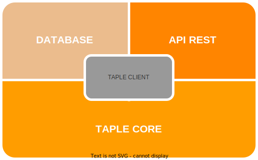

# TAPLE Client

TAPLE Client is an open-source application for creating a TAPLE Node and represents the simplest way to work with TAPLE technology, providing all the necessary elements to build a node. Some of its functions include:

* Using the TAPLE Core library.
* Implementing a REST API to interact with the TAPLE network in an uncomplicated manner.
* Allowing the configuration of various mechanisms: configuration files, startup parameters, and environment variables.

Internally, TAPLE Client is structured into the following modules:

## TAPLE Core

Reference library written in Rust that implements most of the TAPLE functionality. TAPLE Core is not a standalone application, it is a library that implements TAPLE protocols: encodes and decodes of information; interprets received messages; and performs other functions. For more information, refer to [this resource](core-architecture.md).

## Database

This module is responsible for storing the data: configurations, subjects, gobernances, etc. TAPLE client currently uses a [*Leveldb* database](https://github.com/google/leveldb) for information persistence. 

## API REST

TAPLE Client includes a REST API as a method of interaction with the node. It allows actions such as creating and querying subjects, executing events, or approving state changes, among others. For more information, see [this resource](../api-rest/create-event-request.api.mdx).